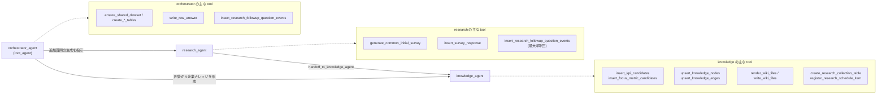
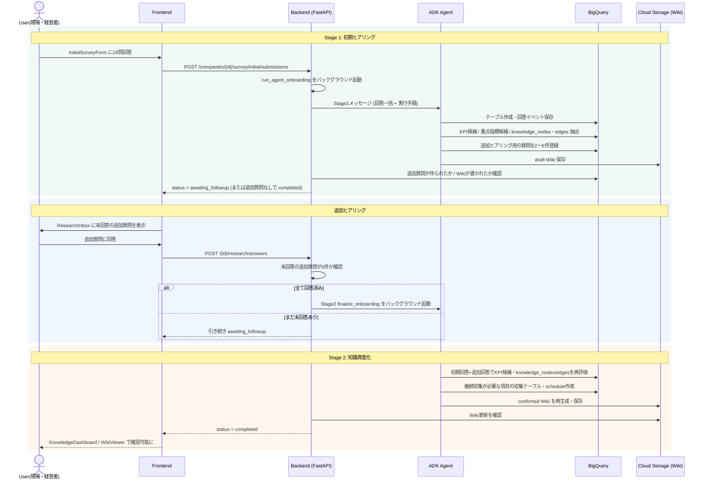
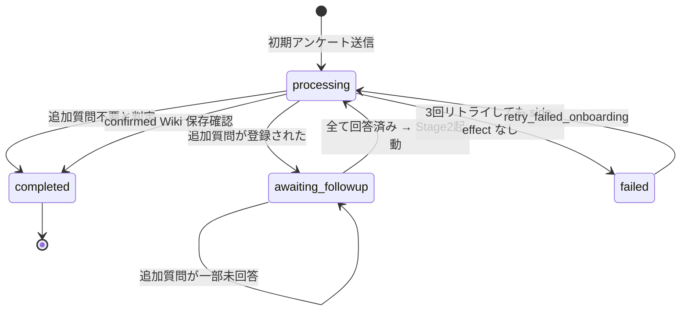
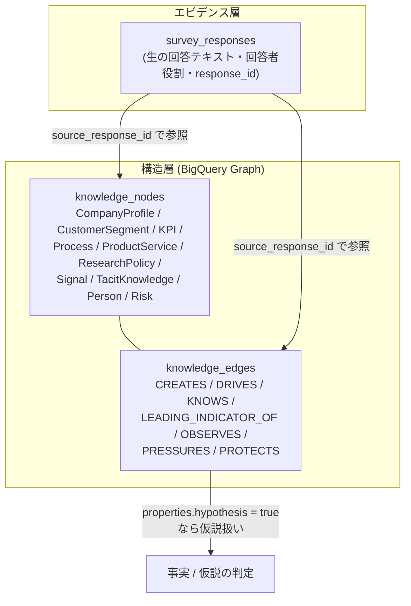

# ai-agent-hackson_consult-copilot

Consult Copilot / Continuous Discovery Agent の実装リポジトリです。中小企業や支援先企業の現場にある暗黙知を継続的に収集し、企業ナレッジ、KPI 候補、重点観測項目、月次レポート、Copilot 画面へつなげる AI エージェントアプリケーションです。

## 開発フロー

Dev Containers または VS Code Server / Remote SSH と、ホスト側の Docker Engine を使います。Docker in Docker は不要です。通常のセットアップ、lint、test、build は Makefile 経由で Docker Compose 内に閉じます。

```bash
make setup
make dev
```

## 構成

```text
front/   Next.js 16.2.9 + React 19.2.7 + TypeScript
back/    Python 3.12 + FastAPI
agent/   Python 3.12 + Google ADK エージェント実装
infra/   Terraform / Cloud Build / Firebase Hosting / Cloud Run
docs/    設計、ローカル開発、コスト、セキュリティ、デモ、ADR
```

## 技術スタック

### フロントエンド

- Node.js 24 LTS
- Next.js 16.2.9
- React 19.2.7
- TypeScript
- Static Export

### バックエンド

- Python 3.12
- FastAPI
- uv
- ruff / mypy / pytest
- Cloud Run 想定
- ローカル検証用 BigQuery Emulator

### エージェント

- Python 3.12
- Google ADK
- Pydantic による構造化入出力
- prompt / tool / eval の初期配置
- Gemini / Vertex AI 連携は設定で切り替え

### インフラ

- Terraform
- Cloud Build
- Cloud Run
- Firebase Hosting
- Secret Manager
- Artifact Registry

## セットアップ

ホスト側に以下を用意します。

- Docker Desktop
- Visual Studio Code
- VS Code 拡張機能: Dev Containers

Windows では `winget` または Chocolatey を使えます。

```powershell
winget install Docker.DockerDesktop
winget install Microsoft.VisualStudioCode
```

```powershell
choco install docker-desktop vscode -y
```

手順:

1. Docker Desktop を起動します。
2. VS Code でこのリポジトリを開きます。
3. Dev Container を使う場合は `Dev Containers: Reopen in Container` を実行します。
4. リポジトリルートでセットアップします。

```bash
make setup
```

## ローカル起動

ホスト側に Node.js、Python、uv、BigQuery Emulator を個別に入れる必要はありません。Docker Compose が各サービスを起動します。

```bash
make dev
```

起動後の確認先:

- Frontend: http://localhost:3000
- Report: http://localhost:3000/report
- Backend API: http://localhost:8000
- Backend health: http://localhost:8000/healthz
- Backend OpenAPI: http://localhost:8000/docs
- BigQuery Emulator: http://localhost:9050

## 画面と操作手順

`front/` はスマートフォン幅のフィード型 UI（`PhoneFrame`）で、画面下部（PC ではサイドバー）の
7 タブで行き来します。基本的な利用の流れは次の通りです。

```
サインイン → 企業を選ぶ/登録する → 初期把握（18問） → 追加質問に回答 → Wiki確定
   → 知識・記録で企業モデルを見る → 質問（研究）に継続回答 → 確認（承認）→ 月次レポート
```

### 0. サインイン（`/signin`）

メールアドレスを入力してサインインします（デモ用途のため、メールアドレスは入力済みのもので、パスワードは固定で「test1234」にしてあります。）。
サインイン後は最初に登録されている企業が選択された状態で
トップ画面（`/`）に遷移します。


### 企業の切り替え・新規登録

画面上部のヘッダーから企業を切り替えられます。「新規企業を登録」から企業コード・
企業名・業種（任意）を入力すると、企業マスタ登録と初期ヒアリング画面（`/intake`）
への遷移が同時に行われます。企業一覧はバックエンドの `GET /api/v1/companies`
から取得するため、他の端末・他のブラウザからでも同じ企業一覧が見えます
（`DELETE /api/v1/companies/{id}` は物理削除ではなく `active_status` を
`inactive` にする論理削除で、一覧から消えるだけです）。


### 1. 発見（`/`, ホーム）

Discovery Feed。直近の変化の兆候（Signal/Risk など）と、次に深掘りすべき観測
テーマの一覧を表示します。企業の状態を俯瞰する起点画面です。
(デフォルトでは事前に用意されたデータが表示されます)


### 2. 初期把握（`/intake`, タブ「初期把握」）

新規企業の最初のステップです。18 問の初期アンケートに、質問ごとに回答者の
役割（経営者・管理者・営業・現場）を選びながら回答します。各質問には
「AIに補足する」チャットがあり、うまく言葉にできない内容を対話しながら
まとめて回答欄に貼り付けられます。

最後の質問まで進むと送信ボタンが表示されます（送信前の誤送信を防ぐため、
入力欄で Enter キーを押しても送信されません）。送信すると、企業用の BigQuery
テーブル作成・回答の保存・KPI/重点管理指標候補の抽出・Wiki ドラフト作成が
バックグラウンドのエージェント処理として始まります（1〜数分かかります）。

処理が進むと、この企業に固有の追加質問（2〜5問）が生成され、同じ画面に
表示されます。ここでの回答はテキストボックスに全問分入力してから、画面下部の
「すべて回答して送信する」ボタンでまとめて送信します（1問ずつの送信ボタンは
ありません）。全問に回答すると、その回答も踏まえて Wiki が自動的に確定され
（人が別途「確定」操作をする必要はありません）、以降は通常の「質問（研究）」
の継続収集サイクルに入ります。

途中で失敗した場合（一時的な通信エラーなど）は、画面に「再試行する」ボタンが
表示されるので、回答をやり直す必要なくその場で再試行できます。


なお、新規企業の場合は質問解答画面に遷移しますが、回答済みの場合は回答内容が表示されます。


### 3. 質問（`/research`, タブ「質問」）

初期把握が完了したあとの継続的なヒアリング画面です。まだ裏付けが弱い
KPI・重点管理指標・観測シグナルについて、AIが平易な言葉で確認質問を自動生成
します。回答者の役割ごとにタブが分かれており（経営者・管理者・営業・現場）、
自分の役割のタブに割り当てられた質問だけに回答します。


### 4. 知識（`/knowledge`, タブ「知識」。旧 `/graph` は自動で `/knowledge` に転送されます）

企業のナレッジグラフ（顧客セグメント・KPI・業務プロセス・兆候・リスク・
暗黙知・人物などのノードと、その関係性を表す線）と、KPI の推移・健全度スコア
を表示します。


ノード同士の線は BigQuery のナレッジグラフ（knowledge_nodes /
knowledge_edges）から実データで描画されます。


### 5. 記録（`/wiki`, タブ「記録」）

企業ナレッジを Wiki 形式（`company_profile.md` / `kpi_definitions.yaml` /
`focus_metrics.yaml` / `research_policy.yaml`）で閲覧します。初期把握の直後は
`draft`（追加質問の回答待ち）、追加質問がすべて回答されたあとは `confirmed`
の状態になります。


### 6. 確認（`/approvals`, タブ「確認」）

人間確認キュー。AIが提案したKPIの新規採用・廃止・大幅変更など、確信度が
低い項目や重要な変更はここに集まります。内容を確認し、承認条件や差し戻し
理由をコメントしたうえで「承認する」「差し戻す」を選びます。承認されるまで、
本番のKPI/重点管理指標定義（current 定義）には反映されません。
※現状、開発中のため、一部のみ実装

### 7. 月次（`/report`, タブ「月次」）

Monthly Discovery Report を表示します。バックエンドは
`GET /api/v1/companies/{company_id}/report/monthly` で
`tenants/{company_id}/reports/monthly/{YYYY-MM}/report.json` を Cloud Storage
またはローカル storage emulator から探索します。

対象月のレポート JSON が存在する場合は保存済みレポートを表示し、存在しない場合は
BigQuery の `knowledge_nodes` / `survey_responses`、または DRY_RUN 用の seed data
から月次レポートを生成して同じパスに保存します。画面にはサマリ、KPI/根拠件数の
グラフ、事実と仮説を分けたハイライト、根拠スニペット、Copilot 質問欄（レポートの
内容について自然文で追加質問できるチャット）を表示します。


## ナレッジ形成における AI エージェントのワークフロー

`front` の3ステップ表示（初期ヒアリング → 追加ヒアリング → 知識資産化、[SignInPage.tsx](../front/components/feature/auth/SignInPage.tsx) の `platformSignals`）が、実際にどのコードで実現されているかを一枚にまとめたものです。

個別の詳細は既存資料を参照してください。本ドキュメントは「全体の流れ」を俯瞰する位置づけで、内容が重複する箇所は既存資料を正としています。

- エージェント構成・tool 一覧の詳細 → [agent-configuration-summary.md](./agent-configuration-summary.md)
- システム全体アーキテクチャ・簡易シーケンス図 → [protopedia-system-architecture.md](./protopedia-system-architecture.md)
- ナレッジグラフのデータモデル設計（2層モデル） → [spec/continuous_discovery_agent_design.md](./spec/continuous_discovery_agent_design.md) §10.0
- プロダクトコンセプト → [usage/consultant_copilot.md](./usage/consultant_copilot.md)

## 1. エージェント構成

`agent/agents/agent.py` で定義される ADK multi-agent 構成です。



`orchestrator_agent` には意図的に `write_wiki_files` や `insert_kpi_candidates` を持たせていません。司令塔が分析なしに空の成果物を shortcut 生成しないよう、分析・成果物生成は `knowledge_agent` に寄せる設計です（[agent-configuration-summary.md](./agent-configuration-summary.md#L52)）。

## 2. 初期ヒアリング → 追加ヒアリング → 知識資産化の全体フロー

`back/app/services/onboarding_service.py` を中心とした、Stage 1（初期ヒアリング後）→ 追加ヒアリング回答 → Stage 2（知識資産化・確定）の流れです。



ポイントは、**backend が agent の自然言語応答を信用せず、BigQuery / Cloud Storage への実際の書き込みを確認してから状態遷移する**ことです（`onboarding_service.py` の `run_agent_onboarding` / `finalize_onboarding`）。LLM が「完了しました」と答えても tool 呼び出しが失敗している場合があるため、side effect の有無で成否を判定します。

## 3. オンボーディング状態遷移



- Stage 1 / Stage 2 とも、モデルの malformed function call 対策として**セッションを毎回作り直しながら最大3回リトライ**します。
- リトライは「まだ追加質問が1件も無いか」で Stage 1 失敗 / Stage 2 失敗を判別し、ユーザーに再回答を求めずに再実行します。

## 4. 知識資産化で扱うデータの二層構造

`knowledge_agent` が形成するナレッジは、**構造（グラフ）と根拠（エビデンス）を分離した2層モデル**です（[spec/continuous_discovery_agent_design.md](./spec/continuous_discovery_agent_design.md) §10.0）。



「事実」か「仮説」かは専用ノード種別ではなく、`edge_type` と `properties.hypothesis` で表現されます。すべてのノード・エッジは `source_response_id` を通じて、どの生回答（誰が・いつ・何と答えたか）に基づくかを追跡できます。

## 5. 承認ゲート（人間承認前提の箇所）

- KPI / 重点管理指標は、まず `kpi_candidates` / `focus_metric_candidates` として登録され、`current` 定義テーブルへの昇格には `approved=True` が必須です（未承認だと `PermissionError`）。
- confidence が 0.7 未満の情報や、Wiki の企業理解を大きく変える更新は人間承認対象としてプロンプト上明記されています。

## 6. 未実装・注意点

- `cost_guard_agent.py` / `quality_eval_agent.py` / `release_gate_agent.py` / `report_agent.py` / `test_data_agent.py` / `ui_review_agent.py` は `agent/agents/` 配下にあるものの、`root_agent` に未配線のプレースホルダです。上記フローには含まれません。
- LLM ベースのグラフ抽出（`upsert_knowledge_nodes` / `upsert_knowledge_edges`）は 2026-07-12 追加分で、実機 Gemini による E2E 動作は未確認（`spec/continuous_discovery_agent_design.md` §23.5）。
- グラフ抽出の成否は onboarding の成功判定には使われていません（追加質問件数と Wiki 書き込みのみで判定、ベストエフォート扱い）。


## よく使うコマンド

```bash
make setup
make dev
make lint
make test
make build
make clean
```

## 個別検証

Makefile 経由で Docker Compose サービス内のツールを実行します。

```bash
make lint
make test
make build
```

## 実装方針

- `front/` は Static Export 前提で実装します。
- MVP では SSR、Server Actions、API Routes は使いません。
- API 呼び出しは `NEXT_PUBLIC_API_BASE_URL` 経由で `back/` に寄せます。
- `package-lock.json` と `uv.lock` はコミット対象です。
- AI の判断は提案に留め、最終承認は人間が行います。
- `.env`、サービスアカウントキー、その他シークレットはコミットしません。

## 現在の状態

- Dashboard UI skeleton: 配置済み
- FastAPI health endpoint: 配置済み
- Monthly Report API and report viewer: 配置済み
- Quality run placeholder API: 配置済み
- Agent evaluation skeleton: 配置済み
- Cloud Build / Terraform skeleton: 配置済み
- Gemini / ADK integration: 設定で切り替え
- Playwright E2E: `front/package.json` の `test:e2e` から実行
