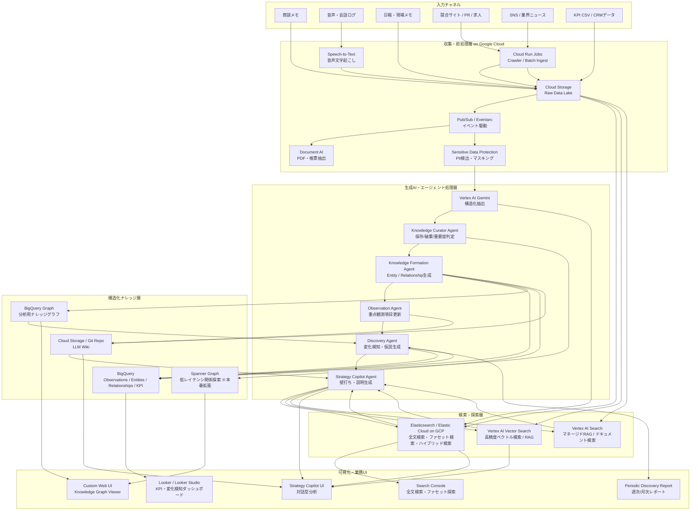
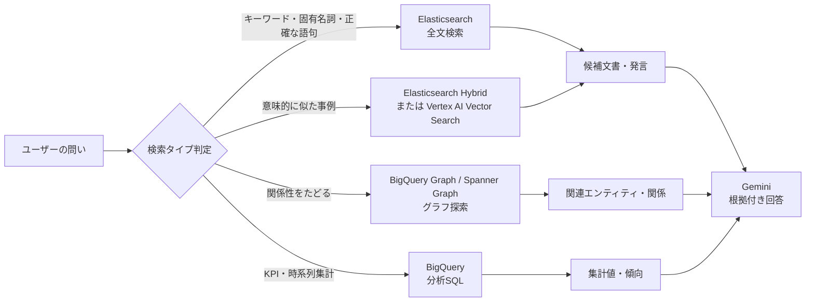
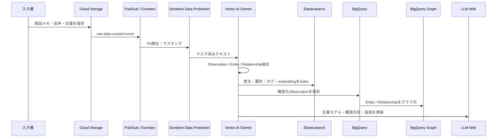
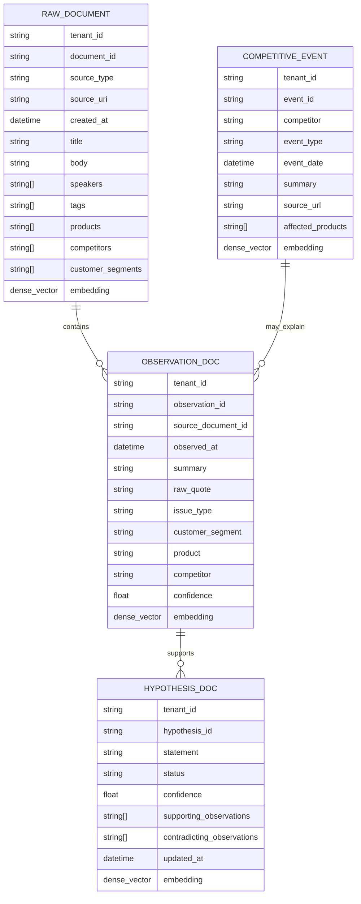
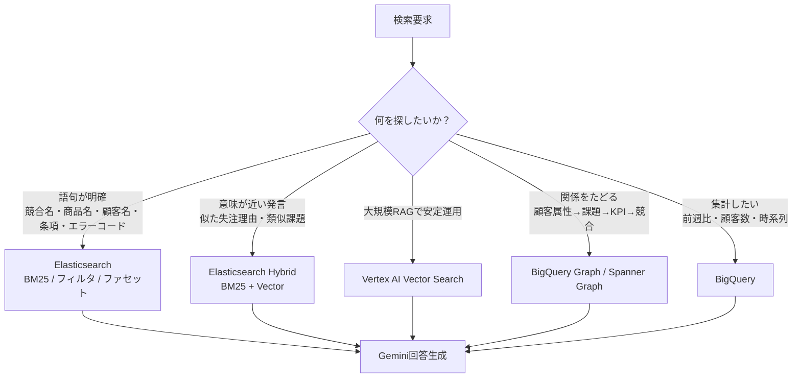
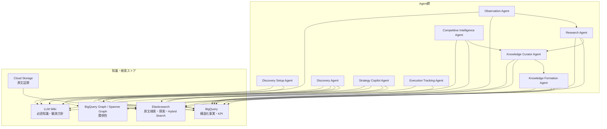

# Continuous Discovery Agent: Elasticsearch活用版サービス構成

## 1. 位置づけ

このドキュメントは、**Continuous Discovery Agent** を Google Cloud 上で構築する前提で、検索・探索基盤として **Elasticsearch / Elastic Cloud on Google Cloud** を一部活用する場合のサービス構成を整理したものです。

Elasticsearchを入れることで、サービスは単なる「ナレッジ形成・可視化」から、**企業内外の非構造情報を高速に探索し、根拠を確認しながら組織学習を進めるプラットフォーム**に近づきます。

ただし、Elasticsearchはナレッジの正本DBではなく、主に以下の役割を担います。

- 商談メモ、日報、競合情報、求人、SNS、議事録などの高速全文検索
- 顧客名、商品名、競合名、エラーコード、条項番号などの厳密検索
- キーワード検索とベクトル検索を組み合わせたハイブリッド検索
- Strategy Copilot / Research Agent が根拠文書を探すための検索API
- コンサルタント向けの探索UI、ファセット検索、フィルタ検索
- 競合情報や観測ログの準リアルタイム検索

Elastic公式では、Elasticsearchは単一APIでBM25などの語彙検索とベクトル検索を組み合わせるハイブリッド検索を実現できると説明されています。また、Elastic CloudはGoogle Cloud Marketplace経由で利用でき、GCP請求と統合できます。

## 2. 全体サービス構成



## 3. Elasticsearchを入れると変わる点

Elasticsearchを入れると、サービスは **「知識を形成する」だけでなく、「知識と原文を高速に探索する」** 方向に拡張されます。

### 変更前

```text
観測
↓
知識化
↓
発見
↓
仮説
↓
追加観測
↓
学習
```

### 変更後

```text
観測
↓
知識化
↓
検索可能化
↓
関係性可視化
↓
発見
↓
仮説
↓
追加観測
↓
学習
```

### 追加される価値

| 機能 | Elasticsearchありの場合の価値 |
|---|---|
| 原文検索 | 商談メモ、日報、競合情報を高速に検索できる |
| ファセット検索 | 顧客属性、商品、競合、期間、担当者で絞り込める |
| ハイブリッド検索 | キーワード一致と意味的類似を組み合わせられる |
| 根拠提示 | LLM回答の根拠発言を即座に提示しやすい |
| 競合監視 | 競合名、職種、技術、媒体、期間で探索できる |
| コンサルタントUI | 人間が仮説を立てながら検索できる |
| RAG | Geminiが回答生成前に関連原文を取得できる |

## 4. 検索ルーティング

ユーザーの問いに応じて、Elasticsearch、Vertex AI Vector Search、BigQuery Graph、BigQueryを使い分けます。



## 5. データ同期シーケンス



## 6. ElasticsearchのIndex設計

Elasticsearchには、原文検索用のIndexと、抽出済みナレッジ検索用のIndexを分けて持ちます。



### 推奨Index

```text
cd_raw_documents
cd_observations
cd_competitive_events
cd_hypotheses
cd_reports
```

### 必須フィールド

各Indexには、最低限以下を持たせます。

| フィールド | 用途 |
|---|---|
| tenant_id | マルチテナント分離 |
| source_uri | 原文証跡へのリンク |
| source_type | 商談、日報、競合記事などの分類 |
| observed_at / created_at | 時系列検索 |
| entity_tags | 顧客、商品、競合、課題などのタグ |
| confidence | LLM抽出結果の信頼度 |
| body / summary / raw_quote | 検索・根拠提示 |
| embedding | ハイブリッド検索・類似検索 |

## 7. 検索方式の使い分け



## 8. Agent別の利用ストア



## 9. 役割分担

| レイヤー | 推奨サービス | 役割 |
|---|---|---|
| 原文保管 | Cloud Storage | 原文証跡、音声、PDF、HTML、CSVの正本 |
| 前処理 | Cloud Run / Document AI / Speech-to-Text | クロール、抽出、文字起こし |
| PII対策 | Sensitive Data Protection | 個人情報・機密情報の検出、マスキング |
| LLM抽出 | Vertex AI Gemini | Observation / Entity / Relationship / Hypothesis抽出 |
| 原文検索 | Elasticsearch | 全文検索、ファセット検索、ハイブリッド検索 |
| 意味検索 | Elasticsearch Hybrid または Vertex AI Vector Search | 類似発言、類似事例、RAG |
| 構造化分析 | BigQuery | 観測事実、KPI、時系列、集計 |
| 関係分析 | BigQuery Graph / Spanner Graph | 顧客属性、課題、商品、競合、KPIの関係探索 |
| LLM Wiki | Cloud Storage / Git Repo | 企業概要、KPI定義、重点観測方針、重要仮説 |
| BI | Looker / Looker Studio | KPI、変化検知、週次/月次レポート |
| 対話UI | Custom Web UI | Strategy Copilot、Graph Viewer、Search Console |

## 10. MVP構成

初期MVPでは、Vertex AI Vector Searchを必須にせず、Elasticsearchのハイブリッド検索で代替してもよいです。

```text
Cloud Storage:
  原文の正本

Elasticsearch:
  原文検索、発言検索、競合情報検索、Hybrid Search

BigQuery:
  構造化Observation、Entity、Relationship、Hypothesis、KPI

BigQuery Graph:
  顧客属性 × 課題 × 商品 × 競合 × KPI の関係分析

LLM Wiki:
  企業概要、用語、KPI定義、重点観測方針、重要仮説

Vertex AI Gemini:
  抽出、分類、要約、仮説生成、レポート生成

Looker / Custom UI:
  KPI・変化検知・ナレッジグラフ・検索UI
```

## 11. 代表的な検索ユースケース

### 11.1 価格関連発言を探す

```text
条件:
- tenant_id = company_a
- source_type = sales_conversation
- observed_at >= now - 30d
- body contains "価格" OR "高い" OR "他社"
- customer_segment = small_retail
```

### 11.2 競合Aに関する最近の兆候を探す

```text
条件:
- competitor = 競合A
- source_type IN competitive_news, job_posting, sales_conversation
- observed_at >= now - 60d
```

### 11.3 類似失注理由を探す

```text
入力:
- "価格は問題ないが、導入後のサポート体制が不安で失注した"

検索:
- Elasticsearch Hybrid Search
- または Vertex AI Vector Search

出力:
- 類似した過去商談
- 類似顧客属性
- 関連商品
- 過去施策
```

## 12. 設計上の注意点

### 12.1 Elasticsearchを正本にしない

Elasticsearchは検索・探索に強い一方、分析の正本や監査証跡の正本にはしない方がよいです。

```text
正本:
Cloud Storage / BigQuery / LLM Wiki

探索:
Elasticsearch

関係分析:
BigQuery Graph / Spanner Graph

生成AI:
Vertex AI Gemini
```

### 12.2 事実と仮説を分離する

```text
事実:
小規模小売顧客から価格関連発言が31件あった

仮説:
競合Aの値下げが原因かもしれない
```

事実と仮説を同じIndexに混在させる場合でも、`doc_type` や `status` を明確に分ける必要があります。

### 12.3 すべての知識に証拠を持たせる

`entity`、`relationship`、`hypothesis`、`report_sentence` には、最低限以下を紐づけます。

```text
source_id
source_uri
raw_quote
confidence
created_by_agent
review_status
```

### 12.4 テナント分離

マルチテナントSaaSを想定する場合、以下を必須にします。

```text
- tenant_id による論理分離
- Index alias または tenant別Indexの設計
- BigQuery Row-level security
- Cloud Storage bucket/prefix分離
- IAM最小権限
- PIIマスキング
- 監査ログ
```

## 13. 推奨結論

Elasticsearchを一部活用する場合の最適な考え方は、次の通りです。

> Elasticsearchは「企業の記憶の正本」ではなく、「企業の記憶を探索する検索エンジン」として置く。

この構成にすると、Google Cloud側の生成AI、分析、グラフ、BIの役割は崩れません。むしろ、以下の2つが強化されます。

1. 現場・コンサルタントが原文を直接探索する体験
2. LLMエージェントが根拠を取りに行く検索体験

したがって、Continuous Discovery Agentのサービス構成は、以下の分担が最も現実的です。

```text
Cloud Storage:
  原文証跡

Elasticsearch:
  全文検索、ファセット検索、ハイブリッド検索

BigQuery:
  構造化された観測事実、KPI、仮説、施策

BigQuery Graph / Spanner Graph:
  顧客属性、課題、商品、競合、KPIの関係探索

LLM Wiki:
  企業概要、用語、KPI定義、重点観測方針、重要仮説

Vertex AI Gemini:
  抽出、分類、要約、仮説生成、レポート生成

Looker / Custom UI:
  KPIダッシュボード、ナレッジグラフ、検索UI、Strategy Copilot
```

## 14. 参考情報

- Elastic Cloud from Google Cloud Platform Marketplace: https://www.elastic.co/docs/deploy-manage/deploy/elastic-cloud/google-cloud-platform-marketplace
- Elasticsearch Hybrid Search: https://www.elastic.co/elasticsearch/hybrid-search
- Google Cloud: RAG infrastructure for generative AI using Vertex AI and Vector Search: https://docs.cloud.google.com/architecture/gen-ai-rag-vertex-ai-vector-search
- Google Cloud: Introduction to BigQuery Graph: https://docs.cloud.google.com/bigquery/docs/graph-overview
