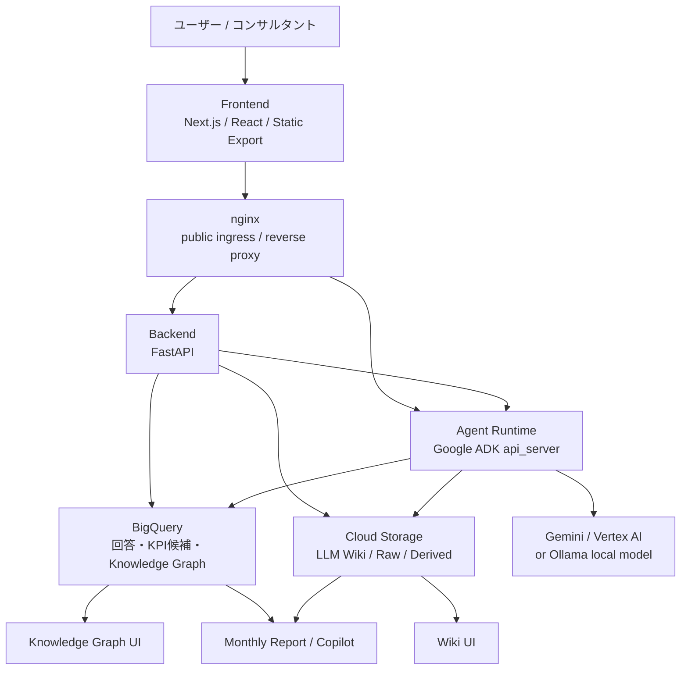
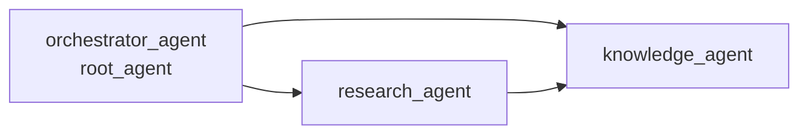
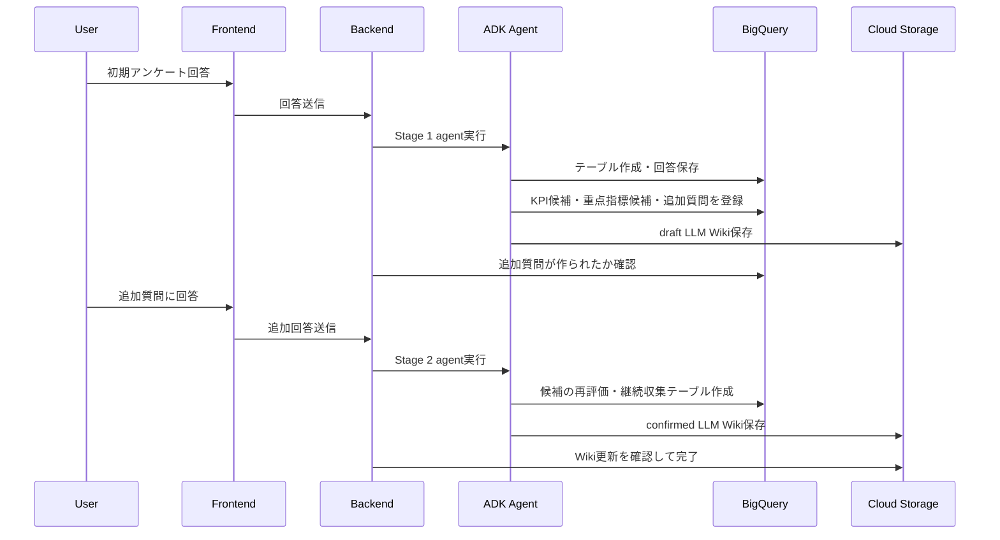

# システム構成説明

## 概要

このプロジェクトは、中小企業や支援先企業の現場にある暗黙知を継続的に収集し、AIエージェントが企業理解、KPI候補、重点観測項目、ナレッジグラフ、LLM Wiki に変換していく「継続的な組織学習プラットフォーム」です。

単なるチャットボットではなく、以下をひとつの業務フローとしてつないでいます。

- 初期アンケートで企業理解の材料を集める
- AIエージェントが追加質問を生成する
- 回答を BigQuery に構造化して蓄積する
- BigQuery Graph 用のノード・エッジを作る
- 人間が読める LLM Wiki を Cloud Storage に保存する
- KPI候補や重点管理指標候補を人間承認に回す
- 月次レポートやCopilot画面で活用する

## 全体アーキテクチャ



リポジトリは大きく次の構成です。

| 領域 | ディレクトリ | 主な技術 | 役割 |
|---|---|---|---|
| Frontend | `front/` | Next.js 16.2.9, React 19.2.7, TypeScript, Tailwind CSS, React Query | Discovery Feed、Intake、Research、Graph、Wiki、Approvals、Report、Copilot 画面 |
| Backend | `back/` | FastAPI, Pydantic, BigQuery, Cloud Storage | API、オンボーディング制御、レポート生成、承認、agent 呼び出し |
| Agent | `agent/` | Google ADK, Python, Pydantic | Orchestrator / Research / Knowledge agent、BigQuery / GCS tool |
| Infra | `infra/` | Terraform, Cloud Run, ALB, Artifact Registry, Secret Manager | GCP基盤、multi-container Cloud Run、CI/CD連携 |
| AI標準 | `.ai/`, `.ai-common` | 共通AGENTS標準、AI review workflow | AI開発ルール、Cost Guard、Release Gate、Security check |

## Cloud Run multi-container 構成

本番想定では、単一の Cloud Run service に3つのコンテナを同居させています。

| コンテナ | ポート | 役割 |
|---|---:|---|
| `nginx` | 8080 | 唯一の public ingress。静的 frontend 配信と reverse proxy |
| `back` | 8000 | FastAPI backend |
| `agent` | 8081 | Google ADK api_server |

nginx は以下のようにルーティングします。

- `/` → Next.js static export
- `/api/*` → FastAPI backend
- `/agent/*` → ADK agent runtime

Cloud Run の ingress は internal load balancer 経由に制限し、外部公開入口は Application Load Balancer に寄せています。アプリ本体は Cloud Run の同一インスタンス内で localhost 通信するため、frontend、backend、agent を一体のサービスとして扱えます。

## AIエージェント構成

`agent/agents/agent.py` に、Google ADK の multi-agent 構成として3つのエージェントが定義されています。



### orchestrator_agent

全体の司令塔です。

- 初期オンボーディングを開始する
- BigQuery dataset / table 作成を指示する
- Research Agent と Knowledge Agent に処理を渡す
- KPIや重点管理指標を自分だけで確定しない
- 未承認の本番反映を避ける

### research_agent

追加質問を作る調査エージェントです。

- 1回の実行で最大3問まで
- 1問1論点
- 回答者が1分程度で答えられる質問にする
- 経営者、現場担当、営業、バックオフィスなど役割別に聞き方を変える
- KPIや指標を確定せず、あくまで情報収集に徹する

### knowledge_agent

企業ナレッジを形成する中核エージェントです。

- 企業プロフィールを作る
- KPI候補を作る
- 重点管理指標候補を作る
- 追加調査方針を作る
- BigQuery Graph 用の node / edge を作る
- LLM Wiki を Markdown / YAML / JSON として生成する
- 継続収集が必要な項目の BigQuery テーブルと schedule を作る

重要な工夫として、`orchestrator_agent` にはあえて Wiki 書き込みや KPI候補登録のような分析後の tool を持たせすぎていません。司令塔が空の成果物を shortcut 生成することを防ぎ、分析と成果物生成は `knowledge_agent` に寄せています。

## オンボーディングからナレッジ化までの流れ



backend は、agent の「完了しました」という自然言語応答だけを信用しません。BigQuery に追加質問が作られたか、Cloud Storage に Wiki が実際に書かれたかを確認して状態遷移します。これは LLM アプリで起きやすい「成功したように言ったが、実際には tool が実行されていない」問題への対策です。

## BigQuery Graph の活用

BigQuery は回答や候補を保存するだけでなく、企業理解のナレッジグラフにも使っています。

主なテーブル:

- `survey_responses`
- `knowledge_nodes`
- `knowledge_edges`
- `kpi_candidates`
- `focus_metric_candidates`
- `research_followup_question_events`
- `current_kpi_definitions`
- `current_focus_metric_definitions`

`knowledge_nodes` には人物、業務、顧客、商品、KPI、兆候、暗黙知などをノードとして保存します。`knowledge_edges` には、それらの関係性を保存します。

例:

- 顧客セグメント → 課題
- 課題 → 商品
- 商品 → KPI
- 現場の発言 → 兆候
- 業務プロセス → 属人化リスク

さらに `PROPERTY GRAPH` のDDLも生成するため、BigQuery Graph として関係性をたどれる設計になっています。frontend の Knowledge Graph 画面では、BigQuery から node / edge を取得して可視化します。

## LLM Wiki の活用

LLM Wiki は、AIと人間が共有する企業理解のドキュメントです。Cloud Storage に `current` と `versions` を分けて保存します。

主なファイル:

- `company_profile.md`
- `kpi_definitions.yaml`
- `focus_metrics.yaml`
- `research_policy.yaml`
- `manifest.json`

保存先の例:

```text
tenants/{company_id}/wiki/current/*
tenants/{company_id}/wiki/versions/{timestamp}/*
```

LLM Wiki の良い点は、BigQuery の構造化データだけでは説明しにくい企業理解を、人間が読める形で残せることです。一方で、YAML / JSON も併せて生成するため、AIエージェントや backend が再利用しやすい形にもなっています。

## Human-in-the-loop と承認設計

AIが抽出した KPI や重点管理指標は、すぐに本番定義として採用しません。

- まず `kpi_candidates` / `focus_metric_candidates` に候補として保存
- confidence や根拠を持たせる
- 承認画面で人間が確認
- 承認後に `current_kpi_definitions` / `current_focus_metric_definitions` へ昇格

agent tool 側でも、current 定義を更新する関数は `approved=True` がないと失敗します。AIが経営判断を代行せず、提案と証拠整理に徹するようにしています。

## 開発環境の工夫

### Docker Compose profile

`docker-compose.yaml` は2つの profile を持っています。

| profile | 用途 | 起動するもの |
|---|---|---|
| `dev` | 通常のローカル開発 | front, back, agent, BigQuery emulator, Ollama, devcontainer |
| `sidecar` | Cloud Run 再現 | nginx, back-sidecar, agent-sidecar |

`dev` profile では、フロントエンド、バックエンド、ADK agent、BigQuery emulator、Ollama をまとめて起動できます。

```bash
make dev
```

`sidecar` profile では、本番の Cloud Run multi-container 構成に近い状態をローカルで再現できます。

```bash
make sidecar
```

これにより、`/`, `/api`, `/agent` の nginx routing や sidecar 間 localhost 通信をデプロイ前に検証できます。

### BigQuery Emulator

ローカル開発では `ghcr.io/goccy/bigquery-emulator` を使います。

- GCPの本物のBigQueryに接続せずにDDLやクエリを検証できる
- `PROJECT_ID=local-project`
- `BQ_DATASET_PREFIX=consultant_copilot`
- backend / agent の両方が emulator に接続可能

外部クラウド費用をかけず、テーブル作成・回答保存・Graph API 周りをローカルで確認できます。

### Ollama

ローカルLLMとして Ollama を利用できます。

- agent の既定モデルはローカル Ollama 系
- `MODEL_ID` を切り替えることで Gemini / Vertex AI にも対応
- ローカルでは API キーやクラウド認証なしで agent flow を試せる

GPUメモリやコンテキスト長に関する調整も `docker-compose.yaml` にコメントとして残されており、ローカル推論の現実的な制約を踏まえた構成です。

### Dev Container

`.devcontainer/devcontainer.json` では、開発に必要な拡張やツールをまとめています。

- Docker outside-of-Docker
- Terraform
- Python 3.12
- Ruff / mypy
- ESLint / Tailwind CSS
- Playwright
- Cloud Code
- GitHub Actions 拡張

ホストには Docker があればよく、Node / Python / uv / Terraform を個別に揃えなくても開発できるようにしています。

## CI/CD

### CI

`.github/workflows/ci.yaml` では、PR に対して以下を実行します。

- AI review
- Security check
- frontend lint / typecheck / build
- backend ruff / mypy / pytest
- agent ruff / mypy / pytest

AI review と security check は `.ai-common` の reusable workflow を呼び出しています。つまり、このプロジェクト固有ではなく、AI開発用の共通基盤として横展開できる仕組みです。

### デプロイ

`.github/workflows/deploy.yml` では、main branch への push または手動実行でデプロイします。

主な流れ:

1. GitHub Actions OIDC で Google Cloud に認証
2. Artifact Registry へ Docker login
3. nginx / back / agent の3 image を build
4. Artifact Registry に push
5. 既存 Cloud Run service YAML を取得
6. 3コンテナの image tag を差し替え
7. `gcloud run services replace` で multi-container service を更新

Workload Identity Federation を使うため、GitHub Secrets に長期サービスアカウントキーを置かない構成です。

## AI用共通リポジトリの活用

`.gitmodules` には `.ai-common` が submodule として定義されています。

```text
path = .ai-common
url = https://github.com/aba4b3a/ai-agent-hackason_ai-common
```

この共通リポジトリは、AI開発に必要な標準やCI部品を再利用するためのものです。

活用しているもの:

- AI review workflow
- security check workflow
- PR template
- AGENTS operating standard
- Cost Guard の考え方
- Release Gate の考え方
- project overlay によるルール上書き

プロジェクト側では `.ai/overlays/AGENTS.project.md` により、共通標準をこのプロダクト向けに上書きしています。たとえば、`agent/agents/agent.py` の `root_agent` が実運用本体であり、`quality_eval_agent.py` などは未配線のプレースホルダであることが明記されています。

## ハーネスエンジニアリング

このプロジェクトでは、AIエージェントを「動いたように見せる」のではなく、検証しやすくするためのハーネスを複数用意しています。

### 1. ローカル検証ハーネス

- BigQuery emulator
- filesystem storage fallback
- Ollama
- Docker Compose dev profile
- Dev Container

クラウド依存を減らし、ローカルで AI + DB + Storage の流れを確認できます。

### 2. Cloud Run 再現ハーネス

`docker compose --profile sidecar` で、本番に近い nginx + back + agent の multi-container 構成を再現できます。

検証できること:

- frontend static 配信
- `/api` reverse proxy
- `/agent` reverse proxy
- sidecar 間 localhost 通信
- Cloud Run の single ingress 構成

### 3. エージェント信頼性ハーネス

backend は agent の最終テキストだけを成功判定にしません。

確認する side effect:

- BigQuery に onboarding follow-up question が作られたか
- Cloud Storage に Wiki が書き込まれたか
- 実行開始時刻以降に成果物が更新されたか

LLM が途中で tool call に失敗したり、成功っぽい文章だけを返した場合でも検出できます。

### 4. テストハーネス

backend:

- onboarding
- survey template
- monthly report
- knowledge extraction
- graph API
- health

agent:

- scoring
- continuous discovery tools

frontend:

- dashboard
- graph

AIの品質評価用には `agent/eval/golden_cases` や `agent/eval/rubrics` もあります。

## セキュリティ・コスト面の工夫

- Workload Identity Federation により、GitHub Actions からGCPへ keyless deploy
- Secret Manager を前提にし、APIキーやサービスアカウントキーをリポジトリに置かない
- Cloud Run は `min_instance_count` / `max_instance_count` を Terraform で制御
- Cloud Storage は artifacts bucket に lifecycle rule を設定
- AIが生成した更新は human approval を前提にする
- `.ai/overlays` で Cost Guard / MCP / Release Gate の運用ルールを定義

## 機能面のアピールポイント

### 1. AIエージェントが継続的に企業理解を深める

初期アンケートで終わらず、追加質問、継続収集スケジュール、Wiki更新までつながっています。企業の状態が変わるたびに、AIが質問とナレッジを更新していく設計です。

### 2. BigQuery Graph による関係性の可視化

回答を単なるテキストとして保存せず、人物、業務、顧客、課題、KPI、兆候の関係として保存します。これにより、コンサルタントが「どの課題がどのKPIに影響しそうか」をグラフとして見られます。

### 3. LLM Wiki による人間とAIの共通知識

LLM Wiki は、人間が読めるドキュメントでありながら、AIが次回以降の推論に使いやすい構造も持ちます。企業理解を「画面に表示する情報」と「AIの記憶」として両立させています。

### 4. AI出力をそのまま採用しない安全設計

KPIや重点管理指標は候補として出し、人間承認後に正式定義へ昇格します。AIが業務判断を勝手に確定しないため、実運用に乗せやすい構成です。

### 5. 開発・検証環境が実運用に近い

BigQuery emulator、Ollama、sidecar profile により、クラウド費用を抑えつつ、本番に近い構成で検証できます。AIアプリで重要な「外部サービス依存」と「tool 実行」をローカルで試せる点が強みです。

### 6. AI開発の共通基盤を使ったチーム開発

`.ai-common` を使い、AI review、security check、PR template、AGENTS標準、Cost Guard、Release Gate の考え方を共通化しています。AIを使って開発するプロジェクト自体も、AI向けのガバナンスを組み込んでいます。

## Protopedia掲載用の短い説明文

本システムは、中小企業や支援先企業の暗黙知を継続的に収集し、AIエージェントが企業理解・KPI候補・重点観測項目・ナレッジグラフ・LLM Wiki に変換する組織学習プラットフォームです。

Frontend は Next.js、Backend は FastAPI、AI Agent は Google ADK で構築し、Cloud Run の multi-container 構成で nginx / backend / agent を1つのサービスとして動かします。データ基盤には BigQuery と Cloud Storage を使い、BigQuery Graph で顧客・課題・業務・KPI の関係性を可視化し、Cloud Storage 上の LLM Wiki で人間とAIが共有できる企業ナレッジを管理します。

AIエージェントは Orchestrator / Research / Knowledge の3体構成です。Research Agent が追加質問を生成し、Knowledge Agent が回答からKPI候補やナレッジグラフ、Wikiを作成します。AIの出力はそのまま本番反映せず、人間承認を経て正式なKPI定義へ昇格する Human-in-the-loop 設計です。

開発環境では BigQuery emulator、Ollama、Dev Container、Cloud Run sidecar再現用の Docker Compose profile を用意し、クラウド費用を抑えながら本番に近い検証ができます。CI/CD では GitHub Actions、Workload Identity Federation、Artifact Registry、Cloud Run deploy を組み合わせ、AI review や security check は `.ai-common` の共通ワークフローを再利用しています。
