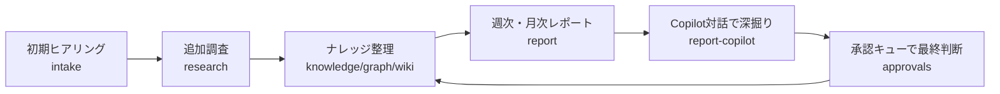

# Continuous Discovery Agent サービス説明資料

最終更新: 2026-07-09

## 1. このサービスが解決する課題

多くの企業では、価値の高い情報が次のような形で散在しています。

- 商談や日報の定性的な記述
- 現場担当の経験知
- 顧客の声や違和感のメモ
- 仮説段階の施策アイデア

この状態では、重要な変化が見えても、組織として再利用しづらくなります。

- 記録が点在する
- チームで共有しづらい
- 時系列での変化を追いづらい
- 意思決定に使える形に整理されにくい

本サービスは、こうした断片情報を「継続的に収集・整理・確認」することで、組織学習の速度を上げることを目的としています。

## 2. 提供価値（ビジネス観点）

### 2.1 変化の早期検知

週次・月次で観測情報をレポート化することで、変化の兆候を早く捉えられます。

- 顧客ニーズの変化
- 競合影響の兆候
- KPI悪化の前兆

### 2.2 意思決定の透明化

提案や候補値をそのまま反映せず、承認キューで人間が判断する運用を前提にしています。

- 誰が何を承認したかを追跡しやすい
- AI提案と最終判断を分離できる
- 組織ガバナンスに適合しやすい

### 2.3 ナレッジ資産化

Wikiと構造化データを併用し、知見を再利用可能な資産として蓄積します。

- 現場知見の再利用
- 担当変更時の引き継ぎ負荷低減
- レポート作成の再現性向上

## 3. 想定ユーザーと利用シーン

### 3.1 主なユーザー

- 経営コンサルタント
- 中小企業診断士
- 事業責任者
- 現場マネージャー

### 3.2 主な利用シーン

- オンボーディング時の企業理解
- 日々の追加ヒアリングと回答回収
- 週次・月次の発見共有
- KPI候補や施策候補の承認判断

## 4. 業務フロー

運用上のポイント:

- 情報収集と意思決定を分離
- レポートで変化を可視化
- 承認結果を再びナレッジ資産へ反映

## 5. 画面ベースの提供機能

- Discovery Feed: 現在の状況を俯瞰
- Intake: 初期ヒアリングの実施
- Knowledge / Graph: 知識と関係性の可視化
- Report / Report Copilot: 月次レポート閲覧と対話深掘り
- Research Inbox: 追加質問への回答運用
- Approvals: 人間承認フロー
- Wiki: ナレッジ文書の閲覧と差分確認

## 6. AIエージェント設計の工夫点（技術要素）

ビジネス価値を担保するために、以下の実装方針が採られています。

### 6.1 Human-in-the-loop 前提

AI提案を直接確定せず、承認キューで最終判断します。

- リスクを抑えた導入が可能
- 監査対応しやすい運用に寄せられる

### 6.2 エージェント障害時のフォールバック

Copilot応答が不安定な場合でも、サービス継続性を保つためのフォールバック経路が実装されています。

- 失敗時の代替応答
- 一時的失敗に対するリトライ

### 6.3 継続観測のループ設計

Research Inbox で未確定事項に追加質問を回し、回答を反映するループを設けています。

- 仮説止まりを減らす
- 情報鮮度を保ちやすい

### 6.4 構造化出力の検証

スキーマ検証APIにより、AI出力を検証して扱える運用が可能です。

- 出力品質の下限を揃えやすい
- 下流処理の安定性を確保しやすい

## 7. 導入効果の評価観点（例）

導入後は、次のKPIでビジネス効果を測定できます。

- 変化兆候の発見件数（週次/月次）
- 承認リードタイム
- 承認済み提案の実行率
- 再利用されたナレッジ件数
- レポート作成工数の削減率

## 8. 提案時のメッセージ例

- このサービスは「提案を自動化するツール」ではなく、「組織学習を加速する運用基盤」です。
- 現場の断片情報を、意思決定に使える知識へ変換します。
- AI活用は前提ですが、最終判断は人間が行うため、実務導入しやすい設計です。

## 9. 現時点での留意事項

- テナント認証・認可は現時点で未強制の実装箇所があります。
- 導入時は、認証方式と運用責任分界を先に確定するのが望ましいです。

---

必要に応じて、この資料を以下用途向けに派生できます。

- 経営層向け1ページ版（価値と投資対効果中心）
- 現場運用向け版（業務フローと操作中心）
- 提案書組み込み版（課題・解決・効果・導入計画テンプレート）
