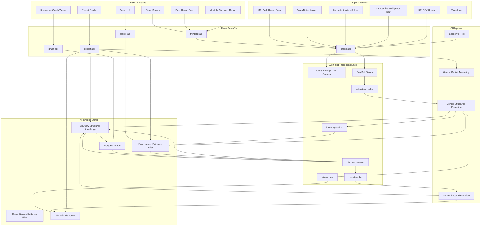
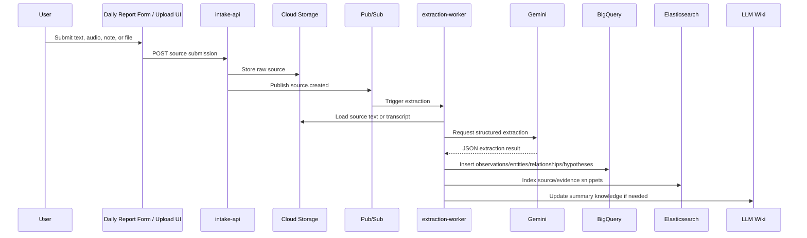
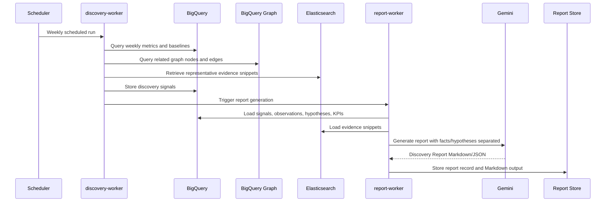
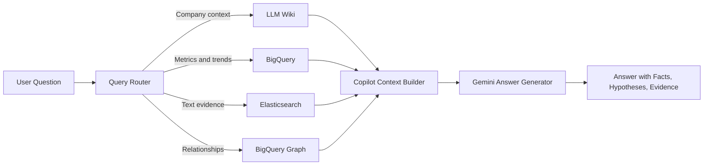

# Design Document: Continuous Discovery Agent MVP

## 1. Introduction

This document defines the technical design for **Continuous Discovery Agent MVP**, based on `continuous_discovery_agent_requirements.md`.

The MVP is a hackathon-oriented organizational learning platform that collects qualitative business information from URL forms, voice input, sales notes, consultant notes, competitive intelligence inputs, and KPI files. It converts unstructured inputs into structured observations, entities, relationships, hypotheses, discovery signals, and periodic reports.

The design follows a Kiro-like flow:

```text
requirements.md
  ↓
design.md
  ↓
tasks.md
```

This document is intended to be converted into `tasks.md` in the next phase.

## 2. Design Goals

### 2.1 Primary Goals

1. Preserve the product's core loop:

   ```text
   Observation
   → Knowledge Formation
   → Discovery
   → Hypothesis
   → Additional Observation
   → Organizational Learning
   ```

2. Prioritize fast knowledge formation over perfect correctness.
3. Clearly separate observed facts from hypotheses.
4. Use BigQuery as the analytical source of truth.
5. Use Elasticsearch as the search and evidence retrieval layer.
6. Use BigQuery Graph for relationship analysis, accepting higher latency.
7. Keep the architecture small enough for a hackathon MVP.
8. Avoid Spanner in the MVP due to cost constraints.
9. Keep logical agents to four or fewer.
10. Make the design directly translatable into implementation tasks.

### 2.2 Non-Goals

The MVP will not implement:

- Spanner or Spanner Graph.
- Low-latency operational graph traversal.
- Production-grade multi-tenant isolation.
- Full privacy/compliance hardening.
- Full CRM, Slack, Teams, Google Workspace, or email integration.
- Advanced anomaly detection ML models.
- Strict approval workflows before AI-extracted knowledge becomes usable.
- Automated business decision execution.

### 2.3 Spanner Design Note

Spanner and Spanner Graph are intentionally excluded from the MVP because of cost and complexity. If the product later requires low-latency graph traversal from an operational application, Spanner Graph may be reconsidered as a future architecture option. For the MVP, graph analysis will use BigQuery Graph over BigQuery entity and relationship tables.

## 3. External Platform Assumptions

This design relies on the following platform capabilities:

- Kiro-style specs are structured around requirements gathering, technical design, and implementation planning.
- BigQuery Graph allows data to be modeled as nodes and edges and queried with GQL over BigQuery data.
- Elasticsearch can support lexical search and vector-based semantic search, enabling hybrid retrieval for evidence search and RAG-like workflows.
- Gemini structured output can produce JSON-schema-like extraction results, which is suitable for extracting observations, entities, relationships, hypotheses, and evidence references from unstructured text.

Reference URLs are listed in [Section 20](#20-references).

## 4. High-Level Architecture



## 5. Architecture Decisions

### AD-001: BigQuery is the Structured Analytical Source of Truth

**Decision:** BigQuery stores observations, entities, relationships, hypotheses, discovery signals, KPI snapshots, reports, and correction records.

**Reasoning:** BigQuery is better suited than Elasticsearch for analytical aggregation, time-series metrics, weekly discovery detection, and graph-derived analytical data.

**Implications:**

- All structured business facts and hypotheses are persisted in BigQuery.
- Elasticsearch may contain copies of selected fields, but those copies are search indexes only.
- Reports and graph analysis should be generated from BigQuery whenever analytical correctness matters.

### AD-002: Elasticsearch is Search and Evidence Retrieval Only

**Decision:** Elasticsearch indexes source text, observation summaries, evidence snippets, tags, and embeddings for search and evidence exploration.

**Reasoning:** Elasticsearch is strong for keyword search, filtering, snippets, faceted search, and hybrid retrieval. It should not become a second analytical source of truth.

**Implications:**

- Elasticsearch powers Search UI and evidence retrieval for Copilot/report generation.
- Elasticsearch records contain BigQuery IDs and Cloud Storage URIs for traceability.
- If BigQuery and Elasticsearch overlap, the design chooses BigQuery for aggregation and Elasticsearch for text retrieval.

### AD-003: BigQuery Graph is Used for Relationship Analysis

**Decision:** BigQuery Graph is used over BigQuery entity and relationship tables.

**Reasoning:** Spanner is excluded, but the MVP still needs relationship analysis among customer segments, issues, products, competitors, KPIs, observations, and hypotheses. BigQuery Graph fits analytical graph exploration with acceptable latency.

**Implications:**

- Graph visualization may not be real-time.
- Queries should limit nodes and edges for demo clarity.
- The UI should use cached or precomputed graph slices when possible.

### AD-004: LLM Extraction is Stored Without Mandatory Human Review

**Decision:** AI-extracted knowledge is stored immediately with confidence, source reference, and extraction metadata.

**Reasoning:** The MVP's value is easy knowledge formation. Human data entry also contains errors, so the system tolerates some extraction error and supports later correction/supersession.

**Implications:**

- Every extracted object includes `confidence`, `source_id`, `extraction_model`, and timestamps.
- The system supports correction, merge, deprecation, and supersession.
- Reports should show confidence and evidence when helpful.

### AD-005: Facts and Hypotheses Are Separate First-Class Objects

**Decision:** Observed facts and hypotheses are separate tables, schemas, UI sections, and report sections.

**Reasoning:** The product must not blur what happened with what may explain it.

**Implications:**

- Observations are factual records extracted from source data.
- Hypotheses are possible explanations linked to supporting or contradicting observations.
- The Report Copilot must phrase causal explanations as hypotheses unless confirmed by explicit evidence.

### AD-006: Four Logical Agents Only

**Decision:** The MVP uses four logical agents:

1. Intake Agent
2. Knowledge Agent
3. Discovery Agent
4. Report Copilot

**Reasoning:** This preserves the concept while keeping one Requirements document and one hackathon-scale architecture.

## 6. Logical Agent Design

### 6.1 Intake Agent

**Purpose:** Collect initial company setup, URL form reports, voice input, sales notes, consultant notes, KPI files, and competitive intelligence inputs.

**Responsibilities:**

- Create company workspace.
- Create initial company model.
- Generate URL-based daily report forms.
- Accept text form submissions.
- Accept audio uploads or recordings.
- Trigger transcription for voice input.
- Store raw sources in Cloud Storage.
- Publish ingestion events to Pub/Sub.
- Generate concise follow-up questions when input is vague and important context is missing.

**Primary Components:**

- `intake-api`
- `frontend-api`
- `Speech-to-Text`
- `Cloud Storage`
- `Pub/Sub`

### 6.2 Knowledge Agent

**Purpose:** Convert unstructured source text into structured business knowledge.

**Responsibilities:**

- Run Gemini structured extraction.
- Extract observations.
- Extract or infer entities.
- Extract relationships.
- Create hypotheses separately from facts.
- Attach evidence references.
- Store structured records in BigQuery.
- Index searchable source and evidence snippets in Elasticsearch.
- Update LLM Wiki pages with summary-level knowledge.

**Primary Components:**

- `extraction-worker`
- `indexing-worker`
- `wiki-worker`
- `Gemini Structured Extraction`
- `BigQuery`
- `Elasticsearch`
- `Cloud Storage`

### 6.3 Discovery Agent

**Purpose:** Detect changes and update observation focus using rule-based statistical logic.

**Responsibilities:**

- Calculate weekly counts and baselines.
- Detect previous-week increases.
- Detect rolling-average increases when history exists.
- Detect new entity appearances.
- Detect co-occurrence between competitive events and issue increases.
- Generate discovery signals.
- Link signals to graph entities and evidence counts.
- Suggest next observation topics.

**Primary Components:**

- `discovery-worker`
- `BigQuery SQL`
- `BigQuery Graph`
- `Elasticsearch evidence lookup`

### 6.4 Report Copilot

**Purpose:** Generate reports and answer consultant questions with evidence while avoiding final business decisions.

**Responsibilities:**

- Generate Monthly Discovery Reports.
- Answer questions using LLM Wiki, BigQuery metrics, and Elasticsearch evidence retrieval.
- Separate observed facts and hypotheses in all outputs.
- Provide evidence snippets and source references.
- Suggest additional observation topics.
- Avoid unsupported causal claims.

**Primary Components:**

- `report-worker`
- `copilot-api`
- `Gemini Report Generation`
- `Gemini Copilot Answering`
- `BigQuery`
- `Elasticsearch`
- `LLM Wiki`

## 7. Service Decomposition

| Service | Runtime | Responsibility |
|---|---|---|
| `frontend-app` | Static hosting or Cloud Run | Setup screen, form UI, search UI, graph viewer, report viewer, copilot UI |
| `frontend-api` | Cloud Run | Backend-for-frontend API aggregation |
| `intake-api` | Cloud Run | Workspace setup, report form submission, file upload registration |
| `search-api` | Cloud Run | Search requests to Elasticsearch and result formatting |
| `graph-api` | Cloud Run | Graph slice API backed by BigQuery Graph or BigQuery queries |
| `copilot-api` | Cloud Run | Conversational question answering orchestration |
| `extraction-worker` | Cloud Run Job or Cloud Run service | Gemini extraction from source text |
| `indexing-worker` | Cloud Run Job or Cloud Run service | Elasticsearch indexing and reindexing |
| `discovery-worker` | Cloud Run Job | Weekly/daily rule-based discovery signal detection |
| `report-worker` | Cloud Run Job | Monthly Discovery Report generation |
| `wiki-worker` | Cloud Run Job or service | LLM Wiki Markdown creation/update |

## 8. Event Flow

### 8.1 Ingestion and Extraction Flow



### 8.2 Weekly Discovery Flow



### 8.3 Copilot Answer Flow



## 9. Data Model

### 9.1 BigQuery Dataset

Dataset name:

```text
continuous_discovery
```

Recommended table naming convention:

```text
workspaces
sources
observations
entities
relationships
hypotheses
discovery_signals
kpi_definitions
kpi_snapshots
reports
corrections
wiki_pages
processing_errors
```

All analytical tables include:

```text
workspace_id STRING NOT NULL
created_at TIMESTAMP NOT NULL
updated_at TIMESTAMP
```

### 9.2 Table: `workspaces`

| Field | Type | Description |
|---|---|---|
| `workspace_id` | STRING | Workspace identifier |
| `workspace_name` | STRING | Company or project name |
| `business_description` | STRING | Business overview |
| `status` | STRING | active, archived |
| `created_at` | TIMESTAMP | Created time |
| `updated_at` | TIMESTAMP | Updated time |

### 9.3 Table: `sources`

| Field | Type | Description |
|---|---|---|
| `source_id` | STRING | Source identifier |
| `workspace_id` | STRING | Workspace identifier |
| `source_type` | STRING | daily_report, voice_transcript, sales_note, consultant_note, competitive_event, kpi_csv |
| `title` | STRING | Source title |
| `source_uri` | STRING | Cloud Storage URI or external URL |
| `body_text_uri` | STRING | URI for extracted text |
| `submitted_by_role` | STRING | owner, consultant, sales, field_staff, unknown |
| `source_timestamp` | TIMESTAMP | Source event time |
| `processing_status` | STRING | received, processed, failed |
| `created_at` | TIMESTAMP | Created time |

### 9.4 Table: `observations`

| Field | Type | Description |
|---|---|---|
| `observation_id` | STRING | Observation identifier |
| `workspace_id` | STRING | Workspace identifier |
| `source_id` | STRING | Source identifier |
| `source_type` | STRING | Source type |
| `observed_at` | TIMESTAMP | Observation timestamp |
| `summary` | STRING | Extracted fact summary |
| `quote` | STRING | Representative quote or snippet |
| `confidence` | FLOAT64 | Extraction confidence |
| `related_entity_ids` | ARRAY<STRING> | Related entities |
| `evidence_uri` | STRING | Cloud Storage source/evidence URI |
| `extraction_model` | STRING | Model/version used |
| `status` | STRING | active, corrected, deprecated, deleted |
| `created_at` | TIMESTAMP | Created time |

Design rule: `observations` are observed facts. They must not contain speculative causal statements unless the source explicitly states them as a reported fact.

### 9.5 Table: `entities`

| Field | Type | Description |
|---|---|---|
| `entity_id` | STRING | Entity identifier |
| `workspace_id` | STRING | Workspace identifier |
| `entity_type` | STRING | CustomerSegment, Product, Issue, Competitor, CompetitiveEvent, KPI, Observation, Hypothesis |
| `name` | STRING | Canonical name |
| `aliases` | ARRAY<STRING> | Alternative names |
| `description` | STRING | Short description |
| `attributes_json` | JSON | Flexible attributes |
| `confidence` | FLOAT64 | Extraction/merge confidence |
| `status` | STRING | active, merged, deprecated |
| `created_at` | TIMESTAMP | Created time |
| `updated_at` | TIMESTAMP | Updated time |

### 9.6 Table: `relationships`

| Field | Type | Description |
|---|---|---|
| `relationship_id` | STRING | Relationship identifier |
| `workspace_id` | STRING | Workspace identifier |
| `from_entity_id` | STRING | Source entity |
| `to_entity_id` | STRING | Target entity |
| `relationship_type` | STRING | MENTIONS, HAS_ISSUE, RELATES_TO, COMPETES_WITH, MAY_CAUSE, IMPACTS, SUPPORTS, CONTRADICTS |
| `strength` | FLOAT64 | Relationship strength score |
| `evidence_count` | INT64 | Supporting evidence count |
| `first_seen_at` | TIMESTAMP | First observed time |
| `last_seen_at` | TIMESTAMP | Last observed time |
| `source_observation_ids` | ARRAY<STRING> | Supporting observations |
| `status` | STRING | active, deprecated, rejected |
| `created_at` | TIMESTAMP | Created time |
| `updated_at` | TIMESTAMP | Updated time |

### 9.7 Table: `hypotheses`

| Field | Type | Description |
|---|---|---|
| `hypothesis_id` | STRING | Hypothesis identifier |
| `workspace_id` | STRING | Workspace identifier |
| `statement` | STRING | Hypothesis statement |
| `status` | STRING | observing, supported, contradicted, superseded, deprecated |
| `confidence` | FLOAT64 | Hypothesis confidence |
| `supporting_observation_ids` | ARRAY<STRING> | Supporting observations |
| `contradicting_observation_ids` | ARRAY<STRING> | Contradicting observations |
| `recommended_observations` | ARRAY<STRING> | Suggested next observations |
| `created_by` | STRING | ai, user, system |
| `created_at` | TIMESTAMP | Created time |
| `updated_at` | TIMESTAMP | Updated time |

Design rule: Hypotheses must be shown separately from observations in UI, report, and Copilot answers.

### 9.8 Table: `discovery_signals`

| Field | Type | Description |
|---|---|---|
| `signal_id` | STRING | Signal identifier |
| `workspace_id` | STRING | Workspace identifier |
| `signal_type` | STRING | weekly_increase, rolling_average_increase, new_entity, co_occurrence |
| `metric_name` | STRING | Metric name |
| `current_value` | FLOAT64 | Current value |
| `baseline_value` | FLOAT64 | Baseline value |
| `change_rate` | FLOAT64 | Change rate |
| `related_entity_ids` | ARRAY<STRING> | Related entities |
| `evidence_count` | INT64 | Supporting evidence count |
| `detected_at` | TIMESTAMP | Detection time |
| `severity` | STRING | low, medium, high |
| `status` | STRING | new, reported, dismissed |

### 9.9 Tables: `kpi_definitions` and `kpi_snapshots`

`kpi_definitions`:

| Field | Type | Description |
|---|---|---|
| `kpi_id` | STRING | KPI identifier |
| `workspace_id` | STRING | Workspace identifier |
| `name` | STRING | KPI name |
| `definition` | STRING | KPI definition |
| `unit` | STRING | yen, count, percent, etc. |
| `is_fixed` | BOOL | Fixed KPI flag |
| `created_at` | TIMESTAMP | Created time |

`kpi_snapshots`:

| Field | Type | Description |
|---|---|---|
| `snapshot_id` | STRING | Snapshot identifier |
| `workspace_id` | STRING | Workspace identifier |
| `kpi_id` | STRING | KPI identifier |
| `period_start` | DATE | Period start |
| `period_end` | DATE | Period end |
| `value` | FLOAT64 | KPI value |
| `source_id` | STRING | Source file or manual entry |
| `created_at` | TIMESTAMP | Created time |

### 9.10 Table: `reports`

| Field | Type | Description |
|---|---|---|
| `report_id` | STRING | Report identifier |
| `workspace_id` | STRING | Workspace identifier |
| `report_type` | STRING | weekly_discovery |
| `period_start` | DATE | Report period start |
| `period_end` | DATE | Report period end |
| `report_markdown` | STRING | Generated report body |
| `related_signal_ids` | ARRAY<STRING> | Discovery signals |
| `related_hypothesis_ids` | ARRAY<STRING> | Hypotheses |
| `created_at` | TIMESTAMP | Created time |

### 9.11 Table: `corrections`

| Field | Type | Description |
|---|---|---|
| `correction_id` | STRING | Correction identifier |
| `workspace_id` | STRING | Workspace identifier |
| `target_type` | STRING | observation, entity, relationship, hypothesis |
| `target_id` | STRING | Target record ID |
| `correction_type` | STRING | edit, merge, deprecate, supersede, delete |
| `original_json` | JSON | Original value snapshot |
| `new_json` | JSON | New value snapshot |
| `created_by` | STRING | User/system identifier |
| `created_at` | TIMESTAMP | Created time |

## 10. BigQuery Graph Design

### 10.0 二層モデル（構造レイヤーと証拠レイヤー）

本設計のグラフは次の二層で構成する（2026-07-09 改訂。実装 `knowledge_nodes` / `knowledge_edges` の語彙を正式仕様とし、旧仕様の Observation / Hypothesis / 証拠は証拠レイヤーとして再配置した）。

```text
┌───────────────────────────────────────────────┐
│ 構造レイヤー（グラフとして描画する層）                      │
│  knowledge_nodes（10ノード型） + knowledge_edges（7関係型）│
│  = 企業の KPI 因果構造・顧客/商品/プロセスの関係            │
└──────────────────┬────────────────────────────┘
                   │ ノード詳細 API（§10.6）で参照
┌──────────────────▼────────────────────────────┐
│ 証拠レイヤー（ノードにしない層）                          │
│  source_response_id（ノード/エッジ列） / survey_responses │
│  = 旧仕様の Observation・Hypothesis の原文・出典            │
└───────────────────────────────────────────────┘
```

- **構造レイヤー**: ユーザがグラフ UI（§16.4）で見る対象。ノード数を絞った「企業の構造理解」を表す。
- **証拠レイヤー**: 観察の原文・アンケート回答・出典。グラフのノードとしては描画せず、ノード選択時のサイドパネル（§16.4 / R14.4）から `source_response_id` 経由で参照する。事実と解釈の分離（R6）は「エッジの事実/仮説区分（§10.2）＋証拠レイヤーへの導線（§10.6）」で担保する。

### 10.1 Node Types（構造レイヤー）

ノードは `knowledge_nodes` テーブルの行である（列: `node_id`, `company_id`, `node_type`, `label`, `description`, `source_response_id`, `confidence`, `valid_from`, `valid_to`, `status`, `properties`, `created_at`, `updated_at`）。`source_response_id` は生成元 `survey_responses.response_id` への単一参照（将来、複数証拠を持たせる場合は `source_refs ARRAY<STRING>` への拡張を検討）。

正式なノード型（10種。2026-07-09 改訂で intake ルール抽出由来の `Person` / `Risk` を追加）:

| node_type | 意味 | 主な生成元 |
|---|---|---|
| `CompanyProfile` | 企業そのもの（1社1ノード。グラフの根） | seed / onboarding |
| `CustomerSegment` | 顧客セグメント（例: 大手自動車部品メーカー） | seed / 抽出 |
| `KPI` | 重要指標（例: 月次売上、リピート率） | seed / 抽出 |
| `Process` | 業務プロセス（例: 検査工程、見積対応） | seed / 抽出 |
| `ProductService` | 商品・サービス（例: 精密切削部品） | seed / 抽出 |
| `ResearchPolicy` | 調査方針・観察テーマ（次に何を聞くか） | seed |
| `Signal` | 変化の兆し・気づき（発見シグナル。仮説的な内容を含み得る） | seed / 抽出 |
| `TacitKnowledge` | 暗黙知（ベテランの経験則・現場ノウハウ・属人スキル） | seed / 抽出 |
| `Person` | 暗黙知・スキルの持ち主（回答中の人物言及から抽出） | intake 抽出 |
| `Risk` | 事業リスク・懸念（退職・故障・トラブル等の兆候） | intake 抽出 |

- MVP では個別顧客はノード化しない（セグメント単位）。`Person` は顧客ではなく社内の知識保有者を表す。
- **廃止した抽出語彙（2026-07-09）**: `Question`（質問原文は survey_responses と証拠レイヤーで担保）、`Skill`（TacitKnowledge に統合）。ローカルの BigQuery エミュレータは揮発性のため旧データ移行は不要。
- 注記: agent の抽出出力に node_type の enum 制約が無いため、自由語彙が混入し得る。将来は抽出スキーマ側で本10型の enum 化を推奨。

### 10.2 Edge Types

エッジは `knowledge_edges` テーブルの行である（列: `edge_id`, `company_id`, `source_node_id`, `target_node_id`, `edge_type`, `description`, `source_response_id`, `confidence`, `strength`, `observed_count`, `properties`, `created_at`, `updated_at`）。

正式な関係型（7種。2026-07-09 改訂で `KNOWS` を追加）と事実/仮説の区分:

| edge_type | 意味 | 区分 |
|---|---|---|
| `CREATES` | プロセス・活動が価値や成果物を生み出す | 事実（観察由来） |
| `DRIVES` | 要因が KPI・結果を押し上げる/動かす | 事実（観察由来） |
| `KNOWS` | Person が暗黙知・スキルを持っている | 事実（観察由来） |
| `LEADING_INDICATOR_OF` | 先行指標である（因果の仮説） | **仮説** |
| `OBSERVES` | 調査方針・活動が対象を観察している | 事実（観察由来) |
| `PRESSURES` | 外部要因・リスク・課題が対象に圧力をかける | 事実（観察由来） |
| `PROTECTS` | 強み・暗黙知が対象を守っている | 事実（観察由来） |

- `LEADING_INDICATOR_OF` は仮説的関連であり、UI では破線などで事実エッジと視覚的に区別する（R6 のグラフ上での担保手段）。抽出エッジは `properties.hypothesis` にも真偽を持つ。
- `strength`（関係の強さ 0..1）と `observed_count`（観測回数）で確からしさを表す。

#### intake ルール抽出のエッジ生成規則（rule_based_mvp）

同一回答内で共起した抽出ノード・既存ノード（簡易名寄せ: 既存ノードの label が回答文に含まれる場合に突き当て）の型ペアに対して張る:

| 型ペア（source → target） | edge_type | 区分 |
|---|---|---|
| Signal → KPI | `LEADING_INDICATOR_OF` | 仮説 |
| Risk → KPI | `PRESSURES` | 事実 |
| TacitKnowledge → KPI | `PROTECTS` | 事実 |
| Person → TacitKnowledge | `KNOWS` | 事実 |

旧抽出語彙 `RELATED_TO`（Question 中心の星形）は廃止し、上記マッピングに置換（2026-07-09）。名寄せで既存ノードに一致した場合は新規ノードを作らず既存ノードへ接続する（seed の KPI 因果グラフと intake 知識の分断防止）。高度な名寄せ（表記ゆれ・embedding）は将来課題。

#### 旧語彙との対応（改訂の記録）

| 旧仕様の語彙 | 本仕様での扱い |
|---|---|
| CustomerSegment / KPI | そのまま（同名） |
| Product | `ProductService` に対応 |
| Issue | `Signal`（課題・変化の兆しとして表現）に対応 |
| Observation | **証拠レイヤーへ移動**。ノード化せず `source_response_id` / `survey_responses` から参照 |
| Hypothesis | **証拠レイヤー＋エッジ区分へ移動**。`Signal` の仮説的側面と `LEADING_INDICATOR_OF` エッジで表現 |
| Competitor / CompetitiveEvent | **現行語彙に無い（既知ギャップ）**。R9.2 の部分未充足。node_type 追加は agent プロンプト・seed データに波及するため将来拡張タスクとする |
| MENTIONS | ≈ `OBSERVES` |
| IMPACTS | ≈ `DRIVES` / `PRESSURES` |
| MAY_CAUSE | ≈ `LEADING_INDICATOR_OF` |
| SUPPORTS / CONTRADICTS | 証拠レイヤーで表現（ノード詳細 API の証拠一覧が支持/矛盾の判断材料を提供） |

### 10.3 Graph Query Use Cases

1. 顧客セグメントを起点に、関連する Signal（課題・変化）と商品・KPI を辿る。
2. Signal を起点に、関連する顧客セグメント・プロセス・KPI・先行指標仮説を辿る。
3. KPI を起点に、それを動かす要因（DRIVES / PRESSURES / LEADING_INDICATOR_OF）を遡って説明候補を得る。
4. TacitKnowledge を起点に、それが守っている価値（PROTECTS）と関係する顧客・商品を確認する。

### 10.4 Graph Slice API

グラフ UI は全グラフを描画せず、常に制限付きスライスを要求する。

```http
GET /api/v1/companies/{company_id}/graph/slice
```

| パラメータ | 型 / 範囲 | 既定 | 意味 |
|---|---|---|---|
| `center_node_id` | string | なし | 中心ノード。**省略時はオーバービュースライス**（confidence 降順の上位ノード＋strength 降順の上位エッジ。初期表示に使う） |
| `depth` | 1..2 | 1 | 中心ノードからの距離。**無向**（source/target どちら向きでも辿る）、edge_type は問わない |
| `limit` | 1..100 | 50 | ノード数上限。超過時は **strength 降順 → confidence 降順** で切り詰め、`meta.truncated=true` を返す |
| `types` | CSV | なし | node_type によるフィルタ（例 `types=Signal,KPI`）。中心ノード自身はフィルタ対象外 |
| `period` | enum | `all` | `last_7_days` / `last_30_days` / `last_90_days` / `all`。ノード・エッジの `created_at` 基準でフィルタ（観測時刻列が無いため。将来 `observed_at` を持つ場合はそちらを基準に移行する） |

レスポンス:

```json
{
  "nodes": [
    {"node_id": "kpi_repeat_rate", "node_type": "KPI", "label": "リピート率",
     "description": "既存顧客の再受注率", "confidence": 0.9, "status": "active"}
  ],
  "edges": [
    {"source_node_id": "sig_inspection_delay", "target_node_id": "kpi_repeat_rate",
     "edge_type": "PRESSURES", "strength": 0.7, "observed_count": 3,
     "description": "検査遅延がリピート率に圧力をかけている"}
  ],
  "meta": {"truncated": false, "center_node_id": null, "period": "all", "source": "bigquery"}
}
```

- `meta.source` はデータ由来（`bigquery` / `sample`）。DRY_RUN や未投入時の seed フォールバックを UI・デバッグから判別できるようにする。
- エッジは `description`（関係の説明文）を含み、UI の関係一覧・選択関係カードに表示する。
- グラフ画面（§16.4）は本 API をデータ源とし、`LEADING_INDICATOR_OF` エッジは**破線**で描画して事実エッジと区別する（§10.2 / R6）。

### 10.5 Entity Search API

グラフ UI のエンティティ検索（§16.4）から `center_node_id` を解決するための API。

```http
GET /api/v1/companies/{company_id}/graph/entities?q=検査&types=Signal,Process&limit=20
```

- `q`: `label` / `description` に対する部分一致（大文字小文字を区別しない）。
- `types`: node_type の CSV フィルタ（省略可）。
- `limit`: 既定 20。

レスポンス:

```json
[
  {"node_id": "sig_inspection_delay", "node_type": "Signal", "label": "検査工程の遅延", "confidence": 0.8}
]
```

### 10.6 Node Detail / Evidence API（証拠レイヤーへの入口）

ノード選択時のサイドパネル（§16.4 / R14.4）の供給源。構造レイヤーから証拠レイヤーへ降りる唯一の正式経路。

```http
GET /api/v1/companies/{company_id}/graph/nodes/{node_id}
```

レスポンス:

- ノードの全属性（`properties` の展開を含む）。
- 隣接エッジ一覧（direction / edge_type / strength / observed_count / 相手ノードの label / source_response_id）。
- **証拠一覧**: ノード自身と隣接エッジの `source_response_id` を `survey_responses` に解決した結果（質問文・原文回答・回答者ロール・収集日時）。

存在しない `node_id` は 404 を返す。

### 10.7 既存 API の位置づけと異常系

- `GET /{company_id}/graph/nodes`（confidence 上位20ノード＋strength 上位30エッジ固定）は、§10.4 の `center_node_id` 省略時と実質等価であり、**slice API へ統合予定**（互換のため当面残置可）。
- `GET /{company_id}/graph/query` は BigQuery Notebook 向けの GQL 文字列生成ユーティリティであり、クエリを実行しない。アプリのグラフ描画経路ではない。
- 異常系:
  - 該当ノードなし → 空配列で 200。
  - `node_id` 不在 → 404。
  - クエリタイムアウト → `limit` / `depth` を下げて再試行（§18 と整合）。

## 11. Elasticsearch Design

### 11.1 Indexes

Recommended indexes:

```text
cd_sources
cd_observations
cd_evidence_snippets
cd_competitive_events
cd_reports
```

### 11.2 Index: `cd_sources`

Purpose: Search raw and processed source documents.

Fields:

| Field | Type | Description |
|---|---|---|
| `workspace_id` | keyword | Workspace filter |
| `source_id` | keyword | Source ID |
| `source_type` | keyword | Source type |
| `title` | text + keyword | Source title |
| `body` | text | Source body text |
| `source_timestamp` | date | Source date |
| `source_uri` | keyword | Cloud Storage URI or URL |
| `customer_segments` | keyword[] | Extracted segment tags |
| `products` | keyword[] | Extracted product tags |
| `competitors` | keyword[] | Extracted competitor tags |
| `issues` | keyword[] | Extracted issue tags |
| `embedding` | dense_vector | Optional semantic vector |

### 11.3 Index: `cd_observations`

Purpose: Search extracted observations and snippets.

Fields:

| Field | Type | Description |
|---|---|---|
| `workspace_id` | keyword | Workspace filter |
| `observation_id` | keyword | BigQuery observation ID |
| `source_id` | keyword | Source ID |
| `summary` | text | Observation summary |
| `quote` | text | Evidence quote |
| `source_type` | keyword | Source type |
| `observed_at` | date | Observation time |
| `entity_ids` | keyword[] | Related entity IDs |
| `entity_names` | keyword[] | Related entity names |
| `confidence` | float | Confidence score |
| `evidence_uri` | keyword | Evidence URI |
| `embedding` | dense_vector | Optional semantic vector |

### 11.4 Search Modes

| Mode | Backend | Use Case |
|---|---|---|
| Keyword search | Elasticsearch lexical search | Exact competitor/product/issue search |
| Facet search | Elasticsearch filters/aggs | Narrow by date, source type, segment, product, competitor |
| Hybrid search | Elasticsearch lexical + vector | Similar evidence and semantic exploration |
| Analytical search | BigQuery | Counts, trends, KPI analysis |
| Graph search | BigQuery Graph | Relationship exploration |

### 11.5 Store Responsibility Rule

If a use case can be handled by both BigQuery and Elasticsearch:

- Use BigQuery for aggregation, reporting metrics, KPI comparison, discovery detection, and graph analytics.
- Use Elasticsearch for evidence snippets, source search, filtering documents, semantic/keyword retrieval, and Copilot grounding.

## 12. LLM Wiki Design

### 12.1 Storage

LLM Wiki pages are Markdown files stored in Cloud Storage or a Git-backed repository.

Suggested path:

```text
gs://<bucket>/wiki/<workspace_id>/
```

### 12.2 Pages

```text
index.md
company_profile.md
products.md
customer_segments.md
competitors.md
kpi_definitions.md
observation_policy.md
active_hypotheses.md
discovery_log.md
source_map.md
```

### 12.3 Purpose

The LLM Wiki is a lightweight human-readable knowledge map. It contains:

- Company context.
- KPI definitions.
- Observation focus.
- Important hypotheses.
- Discovery history.
- Links to source maps and evidence.

It must not contain full raw source documents.

### 12.4 Update Policy

| Trigger | Wiki Update |
|---|---|
| Workspace setup | Create initial pages |
| KPI definition update | Update `kpi_definitions.md` |
| New observation policy | Update `observation_policy.md` |
| Discovery signal reported | Append to `discovery_log.md` |
| Hypothesis created/superseded | Update `active_hypotheses.md` |

## 13. Gemini Structured Extraction Design

### 13.1 Extraction Input

Input to Gemini includes:

- Source text or transcript.
- Workspace context summary from LLM Wiki.
- Current observation policy.
- Existing top entities where available.
- Required JSON schema.

### 13.2 Extraction Output Schema

```json
{
  "observations": [
    {
      "summary": "string",
      "quote": "string",
      "observed_at": "string",
      "source_type": "string",
      "confidence": 0.0,
      "related_entities": ["string"]
    }
  ],
  "entities": [
    {
      "entity_type": "CustomerSegment|Product|Issue|Competitor|CompetitiveEvent|KPI|Observation|Hypothesis",
      "name": "string",
      "aliases": ["string"],
      "description": "string",
      "attributes": {}
    }
  ],
  "relationships": [
    {
      "from_entity_name": "string",
      "to_entity_name": "string",
      "relationship_type": "MENTIONS|HAS_ISSUE|RELATES_TO|COMPETES_WITH|MAY_CAUSE|IMPACTS|SUPPORTS|CONTRADICTS",
      "strength": 0.0,
      "evidence_quote": "string"
    }
  ],
  "hypotheses": [
    {
      "statement": "string",
      "confidence": 0.0,
      "supporting_observation_summaries": ["string"],
      "contradicting_observation_summaries": ["string"],
      "recommended_observations": ["string"]
    }
  ],
  "follow_up_questions": ["string"]
}
```

### 13.3 Extraction Rules

1. Store observations as facts only.
2. Store possible causes as hypotheses.
3. Do not require human approval before storage.
4. Include confidence and source references.
5. Prefer creating useful lightweight knowledge over perfect canonicalization.
6. Support later entity merge and relationship deprecation.

## 14. Rule-Based Discovery Detection

### 14.1 Signal Types

| Signal Type | Detection Rule |
|---|---|
| `weekly_increase` | Current week count exceeds previous week by threshold |
| `rolling_average_increase` | Current week count exceeds N-week rolling average by threshold |
| `new_entity` | New competitor, issue, or product mention appears |
| `co_occurrence` | Competitive event and related issue increase occur in same period |
| `kpi_related_signal` | Qualitative signal increases while related KPI worsens |

### 14.2 Example SQL: Weekly Increase

```sql
WITH weekly AS (
  SELECT
    workspace_id,
    entity_id,
    entity_type,
    DATE_TRUNC(DATE(observed_at), WEEK) AS week_start,
    COUNT(*) AS mention_count
  FROM continuous_discovery.observation_entity_links
  GROUP BY workspace_id, entity_id, entity_type, week_start
), compared AS (
  SELECT
    *,
    LAG(mention_count) OVER (
      PARTITION BY workspace_id, entity_id
      ORDER BY week_start
    ) AS previous_count
  FROM weekly
)
SELECT
  workspace_id,
  entity_id,
  entity_type,
  week_start,
  mention_count AS current_value,
  previous_count AS baseline_value,
  SAFE_DIVIDE(mention_count - previous_count, previous_count) AS change_rate
FROM compared
WHERE previous_count IS NOT NULL
  AND mention_count >= previous_count * 1.5
  AND mention_count >= 5;
```

### 14.3 Threshold Configuration

Workspace-level configuration:

```json
{
  "weekly_increase_rate": 0.5,
  "minimum_current_count": 5,
  "rolling_average_weeks": 4,
  "new_entity_min_evidence_count": 2,
  "co_occurrence_window_days": 14
}
```

## 15. API Design

### 15.1 Workspace Setup

```http
POST /api/workspaces
```

Request:

```json
{
  "workspace_name": "ABC Retail Support",
  "business_description": "Regional retail business",
  "products": ["Product A", "Product B"],
  "customer_segments": ["Small retail customers", "Repeat customers"],
  "competitors": ["Competitor A"],
  "kpis": [
    {"name": "Sales", "unit": "JPY"},
    {"name": "Repeat rate", "unit": "%"}
  ]
}
```

Response:

```json
{
  "workspace_id": "ws_001",
  "status": "created"
}
```

### 15.2 Create Daily Report Form

```http
POST /api/workspaces/{workspace_id}/report-forms
```

Response:

```json
{
  "form_id": "form_001",
  "url": "https://example.app/forms/form_001"
}
```

### 15.3 Submit Daily Report

```http
POST /api/forms/{form_id}/submissions
```

Request:

```json
{
  "submitted_by_role": "field_staff",
  "answers": [
    {"question": "What changed today?", "answer": "Many customers mentioned cheaper competitors."}
  ]
}
```

Response:

```json
{
  "source_id": "src_001",
  "processing_status": "received"
}
```

### 15.4 Upload Voice Input

```http
POST /api/workspaces/{workspace_id}/voice-inputs
```

Response:

```json
{
  "source_id": "src_voice_001",
  "transcription_status": "queued"
}
```

### 15.5 Search Evidence

```http
GET /api/search?workspace_id=ws_001&q=price%20competitor&period=last_30_days&source_type=daily_report
```

Response:

```json
{
  "results": [
    {
      "source_id": "src_001",
      "observation_id": "obs_001",
      "title": "Daily report 2026-06-10",
      "source_type": "daily_report",
      "snippet": "Customers mentioned that Competitor A is cheaper...",
      "tags": ["Price concern", "Competitor A"],
      "evidence_uri": "gs://bucket/src_001.txt"
    }
  ]
}
```

### 15.6 Get Graph Slice

```http
GET /api/v1/companies/{company_id}/graph/slice?center_node_id=sig_inspection_delay&depth=2&limit=50&period=last_30_days
```

パラメータ・レスポンスの完全仕様は §10.4 を参照。エンティティ検索は §10.5、ノード詳細・証拠は §10.6。

### 15.7 Generate or Get Weekly Report

```http
POST /api/workspaces/{workspace_id}/reports/monthly:generate
GET /api/workspaces/{workspace_id}/reports/latest
```

### 15.8 Copilot Question

```http
POST /api/workspaces/{workspace_id}/copilot/ask
```

Request:

```json
{
  "question": "Why are price objections increasing among small retail customers?"
}
```

Response:

```json
{
  "answer": "Observed facts show that price-related comments increased...",
  "observed_facts": [],
  "hypotheses": [],
  "evidence": []
}
```

## 16. UI Design

### 16.1 Setup Screen

Purpose: Capture initial company context.

Fields:

- Company/workspace name.
- Business description.
- Products/services.
- Customer segments.
- Competitors.
- Current issues.
- Fixed KPIs.

Outputs:

- Workspace.
- Initial entities.
- Initial LLM Wiki pages.
- Initial observation policy.

### 16.2 Daily Report Form

Purpose: Lightweight URL-based field report.

Design principles:

- Minimal required fields.
- Questions based on observation policy.
- Accept short answers.
- Allow skip.
- Allow voice input.
- Prefer useful data acquisition over excessive politeness.

Example questions:

- What stood out today?
- Were there customer comments about price, competitors, product, service, or dissatisfaction?
- Did any competitor name appear?
- Which customer segment did this relate to?
- Should we follow up on anything next time?

### 16.3 Search UI

Purpose: Explore source evidence.

Features:

- Keyword search.
- Optional semantic/hybrid search toggle.
- Filters: date, source type, customer segment, product, competitor, issue, confidence.
- Result snippets.
- Evidence links.
- Related observations and hypotheses.

### 16.4 Knowledge Graph Viewer

Purpose: Show relationship slices.

Features:

- Entity search.
- Node type filters.
- Time period filter.
- Depth and limit controls.
- Node details side panel.
- Evidence list for selected relationship.
- Dense graph protection by limiting nodes/edges.

### 16.5 Monthly Discovery Report Viewer

Sections:

1. Executive summary.
2. Discovery signals.
3. Observed facts.
4. Hypotheses.
5. Evidence snippets.
6. Related graph insights.
7. KPI context.
8. Recommended observation topics for next week.
9. Limitations and uncertainty notes.

### 16.6 Report Copilot UI

Purpose: Ask follow-up questions about discoveries.

Guardrails:

- Always distinguish facts and hypotheses.
- Show evidence where available.
- Avoid final business decisions.
- Suggest observation topics instead of definitive actions.

## 17. Periodic Discovery Report Design

### 17.1 Report Generation Inputs

- LLM Wiki context.
- Discovery signals from BigQuery.
- Observations from BigQuery.
- Hypotheses from BigQuery.
- KPI snapshots from BigQuery.
- Evidence snippets from Elasticsearch.
- Graph relationships from BigQuery Graph.
- Stored report JSON from Cloud Storage when it already exists for the requested period.

The current application exposes the previous-month report at
`GET /api/v1/companies/{company_id}/report/monthly`. The backend first checks
`tenants/{company_id}/reports/monthly/{YYYY-MM}/report.json` in Cloud Storage
or the local storage emulator. If the JSON exists, it is returned as the source
of truth. If it does not exist, the backend generates the report from BigQuery
or demo seed data, then saves the JSON to the same path.

### 17.2 Report Prompt Requirements

The report generation prompt must include:

```text
You are generating a Discovery Report.
Separate observed facts from hypotheses.
Do not present hypotheses as confirmed causes.
Do not make final business decisions.
Include evidence counts and representative snippets.
Suggest next observation topics.
Use concise business language.
```

### 17.3 Report Output Template

```markdown
# Monthly Discovery Report

## 1. Summary

## 2. Monthly Indicators

## 3. Observed Facts

## 4. Hypotheses

## 5. Evidence

## 6. Related Customer Segments / Products / Competitors / KPIs

## 7. Recommended Observation Topics

## 8. Limitations
```

### 17.4 Monthly Report Response Shape

The monthly report API returns JSON optimized for the report viewer:

```json
{
  "header": {"title": "Monthly Discovery Report", "subtitle": "Cloud Storageに保存された前月レポート"},
  "monthly": {
    "title": "2026-06 月次レポート",
    "period": "SMB-1042 / 2026-06",
    "source": "cloud_storage",
    "storagePath": "tenants/SMB-1042/reports/monthly/2026-06/report.json"
  },
  "metrics": [],
  "charts": [],
  "sections": [],
  "highlights": [],
  "snippets": [],
  "recommendation": {}
}
```

`monthly.source` is one of `cloud_storage`, `generated`, `generated_and_saved`,
or `generated_unsaved`. UI should show the source status because consultants
need to know whether they are reading the stored monthly report or a newly
generated fallback.

## 18. Error Handling and Retry Strategy

| Failure | Handling |
|---|---|
| Upload failure | Return user-facing error and allow retry |
| Parsing failure | Store original file and create `processing_errors` record |
| Transcription failure | Preserve audio and mark transcription failed |
| Gemini extraction failure | Retry once, then store processing error |
| BigQuery insert failure | Retry with exponential backoff |
| Elasticsearch indexing failure | Store retry event; BigQuery remains source of truth |
| Report generation failure | Store failed report status and allow manual regeneration |
| Graph query timeout | Return reduced graph slice or ask UI to reduce depth/limit |

## 19. Minimal Security and Demo Assumptions

The MVP keeps privacy and compliance controls minimal unless demo data requires them.

Minimum controls:

- Every record includes `workspace_id`.
- Demo data should be anonymized or synthetic where possible.
- Cloud Storage paths are workspace-scoped.
- API should avoid exposing cross-workspace data.
- Evidence links should be resolved through backend APIs, not raw public bucket URLs.
- Secrets for Elasticsearch and Gemini access should not be embedded in frontend code.

Production hardening deferred:

- Strong tenant isolation.
- PII detection and masking.
- Audit logging.
- Role-based access control.
- Data retention policy.
- Compliance review.

## 20. References

- Kiro Feature Specs: https://kiro.dev/docs/specs/feature-specs/
- BigQuery Graph Overview: https://docs.cloud.google.com/bigquery/docs/graph-overview
- Elasticsearch Hybrid Search: https://www.elastic.co/elasticsearch/hybrid-search
- Gemini Structured Output: https://ai.google.dev/gemini-api/docs/structured-output

## 21. Traceability Matrix

| Requirement | Design Sections |
|---|---|
| R1 Initial Company Setup | 6.1, 12, 15.1, 16.1 |
| R2 URL-Based Daily Report Collection | 6.1, 8.1, 15.2, 15.3, 16.2 |
| R3 Voice Input Support | 6.1, 8.1, 15.4, 16.2 |
| R4 Source Data Ingestion | 4, 7, 8.1, 9.3 |
| R5 AI Knowledge Structuring | 6.2, 9, 13 |
| R6 Fact/Hypothesis Separation | 5, 9.4, 9.7, 17 |
| R7 BigQuery Store | 5.1, 9 |
| R8 Elasticsearch Retrieval | 5.2, 11, 15.5, 16.3 |
| R9 BigQuery Graph | 5.3, 10, 15.6, 16.4 |
| R10 LLM Wiki | 12 |
| R11 Rule-Based Discovery Detection | 6.3, 14 |
| R12 Observation Policy | 6.1, 12, 16.2 |
| R13 Discovery Report | 8.2, 17 |
| R14 Graph Visualization | 10, 15.6, 16.4 |
| R15 Search UI | 11, 15.5, 16.3 |
| R16 Report Copilot | 6.4, 8.3, 15.8, 16.6 |
| R17 Correction and Supersession | 9.11 |
| R18 KPI Management | 9.9, 14, 17 |
| R19 Simplified MVP Composition | 4, 6, 7 |
| R20 MVP Guardrails | 5, 16.6, 17, 19 |

## 22. Tasks Handoff

The next `tasks.md` should implement this design in the following order:

1. Provision Cloud Storage bucket and folder structure.
2. Create BigQuery dataset and tables.
3. Create Elasticsearch indexes and mappings.
4. Implement workspace setup API and UI.
5. Implement URL daily report form.
6. Implement source upload and Cloud Storage persistence.
7. Implement optional voice transcription flow.
8. Implement Pub/Sub event flow.
9. Implement Gemini structured extraction worker.
10. Implement BigQuery insertion logic.
11. Implement Elasticsearch indexing logic.
12. Implement LLM Wiki Markdown writer.
13. Implement rule-based discovery SQL and worker.
14. Implement monthly report loader/generator.
15. Implement Search UI and API.
16. Implement graph slice API and viewer.
17. Implement Report Copilot retrieval and answering flow.
18. Implement correction/supersession endpoints.
19. Prepare demo dataset.
20. Prepare hackathon demo scenario.

## 23. Implementation Notes（ローカル開発・モデルバックエンド）

実装で本設計を補足した点の記録。要件は変更しない。

### 23.1 LLM バックエンドの切替（2026-07-07 動作確認済み）

本設計は Gemini を前提とするが（§13）、実装はエージェントを **Google ADK** に統一し、
`Agent(model=settings.model_id)` の **`MODEL_ID` 環境変数**でバックエンドを切り替える:

- `MODEL_ID=ollama/gemma4:12b` — ローカルLLM（Ollama、LiteLLM 経由。GPU 推奨）
- `MODEL_ID=gemini-3.1-flash-lite` 等 — **Gemini（Vertex AI express・APIキー方式）**。
  `GOOGLE_GENAI_USE_VERTEXAI=true` + `GEMINI_API_KEY`（`AQ.` 形式の express キー）で認証。
  copilot 経路（back → agent ADK api_server → Gemini）でエンドツーエンド動作を確認済み。

認証まわりの注意点（`GOOGLE_CLOUD_PROJECT` を設定するとキーが無効化される等）は
`agent/GEMINI_SETUP.md` に集約。`.env` 変更はコンテナの**再作成**（`--force-recreate`）が必要。

### 23.2 BigQuery エミュレータ（ローカル）

§9 の BigQuery はローカルでは **goccy/bigquery-emulator** で代替する（接続確認済み）:

- back: `back/app/db/bigquery.py` — `APP_ENV=local` かつ `BIGQUERY_EMULATOR_HOST` 設定時に
  `AnonymousCredentials` で接続（メタデータサーバ探索によるハング回避を含む）。
- agent: `agent/tools/bigquery_tools.py` に同様の分岐。
- **`PROJECT_ID` はエミュレータ起動時の `--project`（compose では `local-project`）と一致必須**。
  不一致だと 404 project not found になる。
- データセットは全社共有の1つ（`BQ_DATASET_PREFIX`、既定 `consultant_copilot`）で、
  企業ごとの区別はテーブル名プレフィックス（`SMB_1042_knowledge_nodes` 等）で行う。
  エミュレータは永続化しないため、再起動後は `back/scripts/seed_emulator.py` で再投入する。

### 23.3 コンテナ間接続

Docker compose 内のサービス間 URL は `localhost` ではなくサービス名を使う:
`AGENT_BASE_URL=http://agent:8080`（back→agent）、`BIGQUERY_EMULATOR_HOST=http://bigquery-emulator:9050`。
back の copilot は agent 到達不能時に**サンプル応答へフォールバック**するため、
「応答が返る＝AI が動いている」ではない点に注意（確認手順は `agent/GEMINI_SETUP.md`）。

### 23.4 グラフ API とナレッジ抽出語彙（2026-07-09 実装）

- §10.4〜10.6 のグラフ API 3本（slice / entities / ノード詳細+証拠）を実装
  （`back/app/services/graph_service.py`、tasks 12.5〜12.7）。BQ 未投入・DRY_RUN 時は
  seed へフォールバックし、`meta.source`（`bigquery` / `sample`）で判別できる。
- intake ルール抽出（`back/app/services/knowledge_service.py`）の語彙を §10.1/10.2 の
  正式語彙（10ノード型・7関係型）に統一。旧語彙 Question / Skill / RELATED_TO は廃止。
- 簡易名寄せを実装: 既存ノードの label が回答文に含まれる場合、新規ノードを作らず
  既存ノードへエッジ接続する（KPI 因果グラフと intake 知識の分断防止）。
- 注意: **DRY_RUN=true では intake 提出は BigQuery に書き込まれない**（原文 JSON の
  ローカル保存のみ）。グラフへ反映して確認する場合は DRY_RUN=false ＋エミュレータ起動
  ＋ `seed_emulator.py` 投入が必要。
