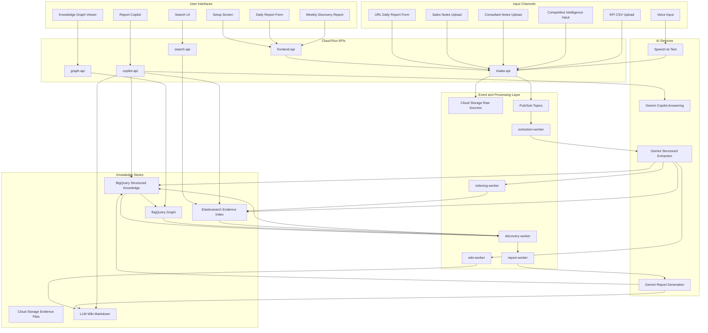
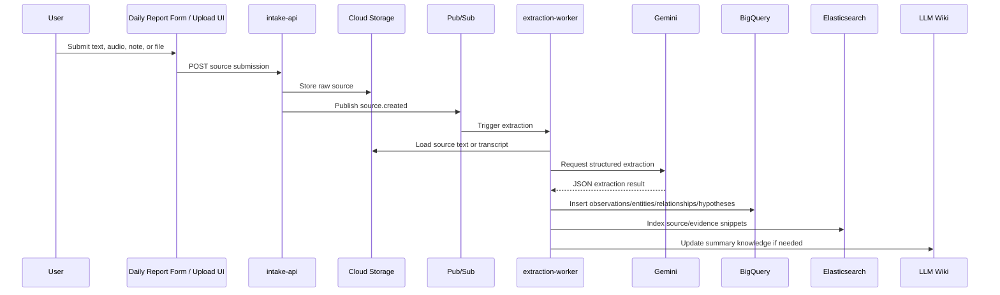
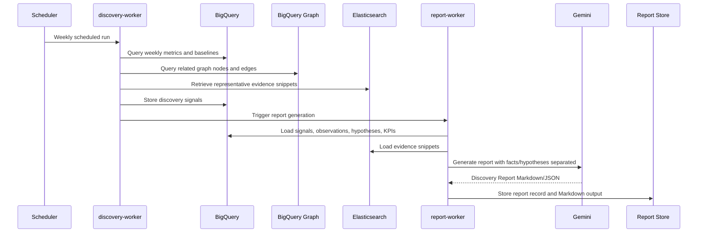
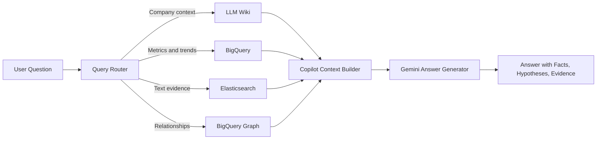

# Design Document: Continuous Discovery Agent MVP

## 1. Introduction

This document defines the technical design for **Continuous Discovery Agent MVP**, based on `continuous_discovery_agent_requirements.md`.

The MVP is a hackathon-oriented organizational learning platform that collects qualitative business information from URL forms, voice input, sales notes, consultant notes, competitive intelligence inputs, and KPI files. It converts unstructured inputs into structured observations, entities, relationships, hypotheses, discovery signals, and weekly reports.

The design follows a Kiro-like flow:

```text
requirements.md
  ↓
design.md
  ↓
tasks.md
```

This document is intended to be converted into `tasks.md` in the next phase.

## 2. Design Goals

### 2.1 Primary Goals

1. Preserve the product's core loop:

   ```text
   Observation
   → Knowledge Formation
   → Discovery
   → Hypothesis
   → Additional Observation
   → Organizational Learning
   ```

2. Prioritize fast knowledge formation over perfect correctness.
3. Clearly separate observed facts from hypotheses.
4. Use BigQuery as the analytical source of truth.
5. Use Elasticsearch as the search and evidence retrieval layer.
6. Use BigQuery Graph for relationship analysis, accepting higher latency.
7. Keep the architecture small enough for a hackathon MVP.
8. Avoid Spanner in the MVP due to cost constraints.
9. Keep logical agents to four or fewer.
10. Make the design directly translatable into implementation tasks.

### 2.2 Non-Goals

The MVP will not implement:

- Spanner or Spanner Graph.
- Low-latency operational graph traversal.
- Production-grade multi-tenant isolation.
- Full privacy/compliance hardening.
- Full CRM, Slack, Teams, Google Workspace, or email integration.
- Advanced anomaly detection ML models.
- Strict approval workflows before AI-extracted knowledge becomes usable.
- Automated business decision execution.

### 2.3 Spanner Design Note

Spanner and Spanner Graph are intentionally excluded from the MVP because of cost and complexity. If the product later requires low-latency graph traversal from an operational application, Spanner Graph may be reconsidered as a future architecture option. For the MVP, graph analysis will use BigQuery Graph over BigQuery entity and relationship tables.

## 3. External Platform Assumptions

This design relies on the following platform capabilities:

- Kiro-style specs are structured around requirements gathering, technical design, and implementation planning.
- BigQuery Graph allows data to be modeled as nodes and edges and queried with GQL over BigQuery data.
- Elasticsearch can support lexical search and vector-based semantic search, enabling hybrid retrieval for evidence search and RAG-like workflows.
- Gemini structured output can produce JSON-schema-like extraction results, which is suitable for extracting observations, entities, relationships, hypotheses, and evidence references from unstructured text.

Reference URLs are listed in [Section 20](#20-references).

## 4. High-Level Architecture



## 5. Architecture Decisions

### AD-001: BigQuery is the Structured Analytical Source of Truth

**Decision:** BigQuery stores observations, entities, relationships, hypotheses, discovery signals, KPI snapshots, reports, and correction records.

**Reasoning:** BigQuery is better suited than Elasticsearch for analytical aggregation, time-series metrics, weekly discovery detection, and graph-derived analytical data.

**Implications:**

- All structured business facts and hypotheses are persisted in BigQuery.
- Elasticsearch may contain copies of selected fields, but those copies are search indexes only.
- Reports and graph analysis should be generated from BigQuery whenever analytical correctness matters.

### AD-002: Elasticsearch is Search and Evidence Retrieval Only

**Decision:** Elasticsearch indexes source text, observation summaries, evidence snippets, tags, and embeddings for search and evidence exploration.

**Reasoning:** Elasticsearch is strong for keyword search, filtering, snippets, faceted search, and hybrid retrieval. It should not become a second analytical source of truth.

**Implications:**

- Elasticsearch powers Search UI and evidence retrieval for Copilot/report generation.
- Elasticsearch records contain BigQuery IDs and Cloud Storage URIs for traceability.
- If BigQuery and Elasticsearch overlap, the design chooses BigQuery for aggregation and Elasticsearch for text retrieval.

### AD-003: BigQuery Graph is Used for Relationship Analysis

**Decision:** BigQuery Graph is used over BigQuery entity and relationship tables.

**Reasoning:** Spanner is excluded, but the MVP still needs relationship analysis among customer segments, issues, products, competitors, KPIs, observations, and hypotheses. BigQuery Graph fits analytical graph exploration with acceptable latency.

**Implications:**

- Graph visualization may not be real-time.
- Queries should limit nodes and edges for demo clarity.
- The UI should use cached or precomputed graph slices when possible.

### AD-004: LLM Extraction is Stored Without Mandatory Human Review

**Decision:** AI-extracted knowledge is stored immediately with confidence, source reference, and extraction metadata.

**Reasoning:** The MVP's value is easy knowledge formation. Human data entry also contains errors, so the system tolerates some extraction error and supports later correction/supersession.

**Implications:**

- Every extracted object includes `confidence`, `source_id`, `extraction_model`, and timestamps.
- The system supports correction, merge, deprecation, and supersession.
- Reports should show confidence and evidence when helpful.

### AD-005: Facts and Hypotheses Are Separate First-Class Objects

**Decision:** Observed facts and hypotheses are separate tables, schemas, UI sections, and report sections.

**Reasoning:** The product must not blur what happened with what may explain it.

**Implications:**

- Observations are factual records extracted from source data.
- Hypotheses are possible explanations linked to supporting or contradicting observations.
- The Report Copilot must phrase causal explanations as hypotheses unless confirmed by explicit evidence.

### AD-006: Four Logical Agents Only

**Decision:** The MVP uses four logical agents:

1. Intake Agent
2. Knowledge Agent
3. Discovery Agent
4. Report Copilot

**Reasoning:** This preserves the concept while keeping one Requirements document and one hackathon-scale architecture.

## 6. Logical Agent Design

### 6.1 Intake Agent

**Purpose:** Collect initial company setup, URL form reports, voice input, sales notes, consultant notes, KPI files, and competitive intelligence inputs.

**Responsibilities:**

- Create company workspace.
- Create initial company model.
- Generate URL-based daily report forms.
- Accept text form submissions.
- Accept audio uploads or recordings.
- Trigger transcription for voice input.
- Store raw sources in Cloud Storage.
- Publish ingestion events to Pub/Sub.
- Generate concise follow-up questions when input is vague and important context is missing.

**Primary Components:**

- `intake-api`
- `frontend-api`
- `Speech-to-Text`
- `Cloud Storage`
- `Pub/Sub`

### 6.2 Knowledge Agent

**Purpose:** Convert unstructured source text into structured business knowledge.

**Responsibilities:**

- Run Gemini structured extraction.
- Extract observations.
- Extract or infer entities.
- Extract relationships.
- Create hypotheses separately from facts.
- Attach evidence references.
- Store structured records in BigQuery.
- Index searchable source and evidence snippets in Elasticsearch.
- Update LLM Wiki pages with summary-level knowledge.

**Primary Components:**

- `extraction-worker`
- `indexing-worker`
- `wiki-worker`
- `Gemini Structured Extraction`
- `BigQuery`
- `Elasticsearch`
- `Cloud Storage`

### 6.3 Discovery Agent

**Purpose:** Detect changes and update observation focus using rule-based statistical logic.

**Responsibilities:**

- Calculate weekly counts and baselines.
- Detect previous-week increases.
- Detect rolling-average increases when history exists.
- Detect new entity appearances.
- Detect co-occurrence between competitive events and issue increases.
- Generate discovery signals.
- Link signals to graph entities and evidence counts.
- Suggest next observation topics.

**Primary Components:**

- `discovery-worker`
- `BigQuery SQL`
- `BigQuery Graph`
- `Elasticsearch evidence lookup`

### 6.4 Report Copilot

**Purpose:** Generate reports and answer consultant questions with evidence while avoiding final business decisions.

**Responsibilities:**

- Generate Weekly Discovery Reports.
- Answer questions using LLM Wiki, BigQuery metrics, and Elasticsearch evidence retrieval.
- Separate observed facts and hypotheses in all outputs.
- Provide evidence snippets and source references.
- Suggest additional observation topics.
- Avoid unsupported causal claims.

**Primary Components:**

- `report-worker`
- `copilot-api`
- `Gemini Report Generation`
- `Gemini Copilot Answering`
- `BigQuery`
- `Elasticsearch`
- `LLM Wiki`

## 7. Service Decomposition

| Service | Runtime | Responsibility |
|---|---|---|
| `frontend-app` | Static hosting or Cloud Run | Setup screen, form UI, search UI, graph viewer, report viewer, copilot UI |
| `frontend-api` | Cloud Run | Backend-for-frontend API aggregation |
| `intake-api` | Cloud Run | Workspace setup, report form submission, file upload registration |
| `search-api` | Cloud Run | Search requests to Elasticsearch and result formatting |
| `graph-api` | Cloud Run | Graph slice API backed by BigQuery Graph or BigQuery queries |
| `copilot-api` | Cloud Run | Conversational question answering orchestration |
| `extraction-worker` | Cloud Run Job or Cloud Run service | Gemini extraction from source text |
| `indexing-worker` | Cloud Run Job or Cloud Run service | Elasticsearch indexing and reindexing |
| `discovery-worker` | Cloud Run Job | Weekly/daily rule-based discovery signal detection |
| `report-worker` | Cloud Run Job | Weekly Discovery Report generation |
| `wiki-worker` | Cloud Run Job or service | LLM Wiki Markdown creation/update |

## 8. Event Flow

### 8.1 Ingestion and Extraction Flow



### 8.2 Weekly Discovery Flow



### 8.3 Copilot Answer Flow



## 9. Data Model

### 9.1 BigQuery Dataset

Dataset name:

```text
continuous_discovery
```

Recommended table naming convention:

```text
workspaces
sources
observations
entities
relationships
hypotheses
discovery_signals
kpi_definitions
kpi_snapshots
reports
corrections
wiki_pages
processing_errors
```

All analytical tables include:

```text
workspace_id STRING NOT NULL
created_at TIMESTAMP NOT NULL
updated_at TIMESTAMP
```

### 9.2 Table: `workspaces`

| Field | Type | Description |
|---|---|---|
| `workspace_id` | STRING | Workspace identifier |
| `workspace_name` | STRING | Company or project name |
| `business_description` | STRING | Business overview |
| `status` | STRING | active, archived |
| `created_at` | TIMESTAMP | Created time |
| `updated_at` | TIMESTAMP | Updated time |

### 9.3 Table: `sources`

| Field | Type | Description |
|---|---|---|
| `source_id` | STRING | Source identifier |
| `workspace_id` | STRING | Workspace identifier |
| `source_type` | STRING | daily_report, voice_transcript, sales_note, consultant_note, competitive_event, kpi_csv |
| `title` | STRING | Source title |
| `source_uri` | STRING | Cloud Storage URI or external URL |
| `body_text_uri` | STRING | URI for extracted text |
| `submitted_by_role` | STRING | owner, consultant, sales, field_staff, unknown |
| `source_timestamp` | TIMESTAMP | Source event time |
| `processing_status` | STRING | received, processed, failed |
| `created_at` | TIMESTAMP | Created time |

### 9.4 Table: `observations`

| Field | Type | Description |
|---|---|---|
| `observation_id` | STRING | Observation identifier |
| `workspace_id` | STRING | Workspace identifier |
| `source_id` | STRING | Source identifier |
| `source_type` | STRING | Source type |
| `observed_at` | TIMESTAMP | Observation timestamp |
| `summary` | STRING | Extracted fact summary |
| `quote` | STRING | Representative quote or snippet |
| `confidence` | FLOAT64 | Extraction confidence |
| `related_entity_ids` | ARRAY<STRING> | Related entities |
| `evidence_uri` | STRING | Cloud Storage source/evidence URI |
| `extraction_model` | STRING | Model/version used |
| `status` | STRING | active, corrected, deprecated, deleted |
| `created_at` | TIMESTAMP | Created time |

Design rule: `observations` are observed facts. They must not contain speculative causal statements unless the source explicitly states them as a reported fact.

### 9.5 Table: `entities`

| Field | Type | Description |
|---|---|---|
| `entity_id` | STRING | Entity identifier |
| `workspace_id` | STRING | Workspace identifier |
| `entity_type` | STRING | CustomerSegment, Product, Issue, Competitor, CompetitiveEvent, KPI, Observation, Hypothesis |
| `name` | STRING | Canonical name |
| `aliases` | ARRAY<STRING> | Alternative names |
| `description` | STRING | Short description |
| `attributes_json` | JSON | Flexible attributes |
| `confidence` | FLOAT64 | Extraction/merge confidence |
| `status` | STRING | active, merged, deprecated |
| `created_at` | TIMESTAMP | Created time |
| `updated_at` | TIMESTAMP | Updated time |

### 9.6 Table: `relationships`

| Field | Type | Description |
|---|---|---|
| `relationship_id` | STRING | Relationship identifier |
| `workspace_id` | STRING | Workspace identifier |
| `from_entity_id` | STRING | Source entity |
| `to_entity_id` | STRING | Target entity |
| `relationship_type` | STRING | MENTIONS, HAS_ISSUE, RELATES_TO, COMPETES_WITH, MAY_CAUSE, IMPACTS, SUPPORTS, CONTRADICTS |
| `strength` | FLOAT64 | Relationship strength score |
| `evidence_count` | INT64 | Supporting evidence count |
| `first_seen_at` | TIMESTAMP | First observed time |
| `last_seen_at` | TIMESTAMP | Last observed time |
| `source_observation_ids` | ARRAY<STRING> | Supporting observations |
| `status` | STRING | active, deprecated, rejected |
| `created_at` | TIMESTAMP | Created time |
| `updated_at` | TIMESTAMP | Updated time |

### 9.7 Table: `hypotheses`

| Field | Type | Description |
|---|---|---|
| `hypothesis_id` | STRING | Hypothesis identifier |
| `workspace_id` | STRING | Workspace identifier |
| `statement` | STRING | Hypothesis statement |
| `status` | STRING | observing, supported, contradicted, superseded, deprecated |
| `confidence` | FLOAT64 | Hypothesis confidence |
| `supporting_observation_ids` | ARRAY<STRING> | Supporting observations |
| `contradicting_observation_ids` | ARRAY<STRING> | Contradicting observations |
| `recommended_observations` | ARRAY<STRING> | Suggested next observations |
| `created_by` | STRING | ai, user, system |
| `created_at` | TIMESTAMP | Created time |
| `updated_at` | TIMESTAMP | Updated time |

Design rule: Hypotheses must be shown separately from observations in UI, report, and Copilot answers.

### 9.8 Table: `discovery_signals`

| Field | Type | Description |
|---|---|---|
| `signal_id` | STRING | Signal identifier |
| `workspace_id` | STRING | Workspace identifier |
| `signal_type` | STRING | weekly_increase, rolling_average_increase, new_entity, co_occurrence |
| `metric_name` | STRING | Metric name |
| `current_value` | FLOAT64 | Current value |
| `baseline_value` | FLOAT64 | Baseline value |
| `change_rate` | FLOAT64 | Change rate |
| `related_entity_ids` | ARRAY<STRING> | Related entities |
| `evidence_count` | INT64 | Supporting evidence count |
| `detected_at` | TIMESTAMP | Detection time |
| `severity` | STRING | low, medium, high |
| `status` | STRING | new, reported, dismissed |

### 9.9 Tables: `kpi_definitions` and `kpi_snapshots`

`kpi_definitions`:

| Field | Type | Description |
|---|---|---|
| `kpi_id` | STRING | KPI identifier |
| `workspace_id` | STRING | Workspace identifier |
| `name` | STRING | KPI name |
| `definition` | STRING | KPI definition |
| `unit` | STRING | yen, count, percent, etc. |
| `is_fixed` | BOOL | Fixed KPI flag |
| `created_at` | TIMESTAMP | Created time |

`kpi_snapshots`:

| Field | Type | Description |
|---|---|---|
| `snapshot_id` | STRING | Snapshot identifier |
| `workspace_id` | STRING | Workspace identifier |
| `kpi_id` | STRING | KPI identifier |
| `period_start` | DATE | Period start |
| `period_end` | DATE | Period end |
| `value` | FLOAT64 | KPI value |
| `source_id` | STRING | Source file or manual entry |
| `created_at` | TIMESTAMP | Created time |

### 9.10 Table: `reports`

| Field | Type | Description |
|---|---|---|
| `report_id` | STRING | Report identifier |
| `workspace_id` | STRING | Workspace identifier |
| `report_type` | STRING | weekly_discovery |
| `period_start` | DATE | Report period start |
| `period_end` | DATE | Report period end |
| `report_markdown` | STRING | Generated report body |
| `related_signal_ids` | ARRAY<STRING> | Discovery signals |
| `related_hypothesis_ids` | ARRAY<STRING> | Hypotheses |
| `created_at` | TIMESTAMP | Created time |

### 9.11 Table: `corrections`

| Field | Type | Description |
|---|---|---|
| `correction_id` | STRING | Correction identifier |
| `workspace_id` | STRING | Workspace identifier |
| `target_type` | STRING | observation, entity, relationship, hypothesis |
| `target_id` | STRING | Target record ID |
| `correction_type` | STRING | edit, merge, deprecate, supersede, delete |
| `original_json` | JSON | Original value snapshot |
| `new_json` | JSON | New value snapshot |
| `created_by` | STRING | User/system identifier |
| `created_at` | TIMESTAMP | Created time |

## 10. BigQuery Graph Design

### 10.1 Node Tables

BigQuery Graph uses selected rows from `entities` and derived views.

Recommended node categories:

- CustomerSegment
- Product
- Issue
- Competitor
- CompetitiveEvent
- KPI
- Observation
- Hypothesis

For MVP simplicity, individual customers are not required as graph nodes. Customer-level detail may be modeled later if needed.

### 10.2 Edge Tables

Edges come from `relationships`.

Supported MVP relationship types:

| Relationship Type | Meaning |
|---|---|
| `MENTIONS` | Observation or customer segment mentions issue, product, competitor, etc. |
| `HAS_ISSUE` | Customer segment has an issue |
| `RELATES_TO` | Generic relation when a more specific relation is not available |
| `COMPETES_WITH` | Product or company competes with competitor |
| `MAY_CAUSE` | Hypothesis or event may cause an issue/signal |
| `IMPACTS` | Issue or signal impacts KPI |
| `SUPPORTS` | Observation supports hypothesis |
| `CONTRADICTS` | Observation contradicts hypothesis |

### 10.3 Graph Query Use Cases

1. Given a customer segment, find top related issues and competitors.
2. Given a discovery signal, find related customer segments, products, issues, KPIs, and hypotheses.
3. Given a competitor, find related observations, affected products, and possible KPI impact.
4. Given a KPI, find issues and hypotheses that may explain changes.

### 10.4 Graph Slice API Strategy

The graph UI should not render the entire graph. It should request bounded slices.

Example request:

```http
GET /api/graph/slice?workspace_id=ws_001&entity_id=ent_issue_price&depth=2&limit=50&period=last_30_days
```

Example response:

```json
{
  "nodes": [
    {"id": "ent_issue_price", "type": "Issue", "label": "Price concern"},
    {"id": "ent_segment_small_retail", "type": "CustomerSegment", "label": "Small retail customers"}
  ],
  "edges": [
    {"from": "ent_segment_small_retail", "to": "ent_issue_price", "type": "MENTIONS", "evidence_count": 31}
  ]
}
```

## 11. Elasticsearch Design

### 11.1 Indexes

Recommended indexes:

```text
cd_sources
cd_observations
cd_evidence_snippets
cd_competitive_events
cd_reports
```

### 11.2 Index: `cd_sources`

Purpose: Search raw and processed source documents.

Fields:

| Field | Type | Description |
|---|---|---|
| `workspace_id` | keyword | Workspace filter |
| `source_id` | keyword | Source ID |
| `source_type` | keyword | Source type |
| `title` | text + keyword | Source title |
| `body` | text | Source body text |
| `source_timestamp` | date | Source date |
| `source_uri` | keyword | Cloud Storage URI or URL |
| `customer_segments` | keyword[] | Extracted segment tags |
| `products` | keyword[] | Extracted product tags |
| `competitors` | keyword[] | Extracted competitor tags |
| `issues` | keyword[] | Extracted issue tags |
| `embedding` | dense_vector | Optional semantic vector |

### 11.3 Index: `cd_observations`

Purpose: Search extracted observations and snippets.

Fields:

| Field | Type | Description |
|---|---|---|
| `workspace_id` | keyword | Workspace filter |
| `observation_id` | keyword | BigQuery observation ID |
| `source_id` | keyword | Source ID |
| `summary` | text | Observation summary |
| `quote` | text | Evidence quote |
| `source_type` | keyword | Source type |
| `observed_at` | date | Observation time |
| `entity_ids` | keyword[] | Related entity IDs |
| `entity_names` | keyword[] | Related entity names |
| `confidence` | float | Confidence score |
| `evidence_uri` | keyword | Evidence URI |
| `embedding` | dense_vector | Optional semantic vector |

### 11.4 Search Modes

| Mode | Backend | Use Case |
|---|---|---|
| Keyword search | Elasticsearch lexical search | Exact competitor/product/issue search |
| Facet search | Elasticsearch filters/aggs | Narrow by date, source type, segment, product, competitor |
| Hybrid search | Elasticsearch lexical + vector | Similar evidence and semantic exploration |
| Analytical search | BigQuery | Counts, trends, KPI analysis |
| Graph search | BigQuery Graph | Relationship exploration |

### 11.5 Store Responsibility Rule

If a use case can be handled by both BigQuery and Elasticsearch:

- Use BigQuery for aggregation, reporting metrics, KPI comparison, discovery detection, and graph analytics.
- Use Elasticsearch for evidence snippets, source search, filtering documents, semantic/keyword retrieval, and Copilot grounding.

## 12. LLM Wiki Design

### 12.1 Storage

LLM Wiki pages are Markdown files stored in Cloud Storage or a Git-backed repository.

Suggested path:

```text
gs://<bucket>/wiki/<workspace_id>/
```

### 12.2 Pages

```text
index.md
company_profile.md
products.md
customer_segments.md
competitors.md
kpi_definitions.md
observation_policy.md
active_hypotheses.md
discovery_log.md
source_map.md
```

### 12.3 Purpose

The LLM Wiki is a lightweight human-readable knowledge map. It contains:

- Company context.
- KPI definitions.
- Observation focus.
- Important hypotheses.
- Discovery history.
- Links to source maps and evidence.

It must not contain full raw source documents.

### 12.4 Update Policy

| Trigger | Wiki Update |
|---|---|
| Workspace setup | Create initial pages |
| KPI definition update | Update `kpi_definitions.md` |
| New observation policy | Update `observation_policy.md` |
| Discovery signal reported | Append to `discovery_log.md` |
| Hypothesis created/superseded | Update `active_hypotheses.md` |

## 13. Gemini Structured Extraction Design

### 13.1 Extraction Input

Input to Gemini includes:

- Source text or transcript.
- Workspace context summary from LLM Wiki.
- Current observation policy.
- Existing top entities where available.
- Required JSON schema.

### 13.2 Extraction Output Schema

```json
{
  "observations": [
    {
      "summary": "string",
      "quote": "string",
      "observed_at": "string",
      "source_type": "string",
      "confidence": 0.0,
      "related_entities": ["string"]
    }
  ],
  "entities": [
    {
      "entity_type": "CustomerSegment|Product|Issue|Competitor|CompetitiveEvent|KPI|Observation|Hypothesis",
      "name": "string",
      "aliases": ["string"],
      "description": "string",
      "attributes": {}
    }
  ],
  "relationships": [
    {
      "from_entity_name": "string",
      "to_entity_name": "string",
      "relationship_type": "MENTIONS|HAS_ISSUE|RELATES_TO|COMPETES_WITH|MAY_CAUSE|IMPACTS|SUPPORTS|CONTRADICTS",
      "strength": 0.0,
      "evidence_quote": "string"
    }
  ],
  "hypotheses": [
    {
      "statement": "string",
      "confidence": 0.0,
      "supporting_observation_summaries": ["string"],
      "contradicting_observation_summaries": ["string"],
      "recommended_observations": ["string"]
    }
  ],
  "follow_up_questions": ["string"]
}
```

### 13.3 Extraction Rules

1. Store observations as facts only.
2. Store possible causes as hypotheses.
3. Do not require human approval before storage.
4. Include confidence and source references.
5. Prefer creating useful lightweight knowledge over perfect canonicalization.
6. Support later entity merge and relationship deprecation.

## 14. Rule-Based Discovery Detection

### 14.1 Signal Types

| Signal Type | Detection Rule |
|---|---|
| `weekly_increase` | Current week count exceeds previous week by threshold |
| `rolling_average_increase` | Current week count exceeds N-week rolling average by threshold |
| `new_entity` | New competitor, issue, or product mention appears |
| `co_occurrence` | Competitive event and related issue increase occur in same period |
| `kpi_related_signal` | Qualitative signal increases while related KPI worsens |

### 14.2 Example SQL: Weekly Increase

```sql
WITH weekly AS (
  SELECT
    workspace_id,
    entity_id,
    entity_type,
    DATE_TRUNC(DATE(observed_at), WEEK) AS week_start,
    COUNT(*) AS mention_count
  FROM continuous_discovery.observation_entity_links
  GROUP BY workspace_id, entity_id, entity_type, week_start
), compared AS (
  SELECT
    *,
    LAG(mention_count) OVER (
      PARTITION BY workspace_id, entity_id
      ORDER BY week_start
    ) AS previous_count
  FROM weekly
)
SELECT
  workspace_id,
  entity_id,
  entity_type,
  week_start,
  mention_count AS current_value,
  previous_count AS baseline_value,
  SAFE_DIVIDE(mention_count - previous_count, previous_count) AS change_rate
FROM compared
WHERE previous_count IS NOT NULL
  AND mention_count >= previous_count * 1.5
  AND mention_count >= 5;
```

### 14.3 Threshold Configuration

Workspace-level configuration:

```json
{
  "weekly_increase_rate": 0.5,
  "minimum_current_count": 5,
  "rolling_average_weeks": 4,
  "new_entity_min_evidence_count": 2,
  "co_occurrence_window_days": 14
}
```

## 15. API Design

### 15.1 Workspace Setup

```http
POST /api/workspaces
```

Request:

```json
{
  "workspace_name": "ABC Retail Support",
  "business_description": "Regional retail business",
  "products": ["Product A", "Product B"],
  "customer_segments": ["Small retail customers", "Repeat customers"],
  "competitors": ["Competitor A"],
  "kpis": [
    {"name": "Sales", "unit": "JPY"},
    {"name": "Repeat rate", "unit": "%"}
  ]
}
```

Response:

```json
{
  "workspace_id": "ws_001",
  "status": "created"
}
```

### 15.2 Create Daily Report Form

```http
POST /api/workspaces/{workspace_id}/report-forms
```

Response:

```json
{
  "form_id": "form_001",
  "url": "https://example.app/forms/form_001"
}
```

### 15.3 Submit Daily Report

```http
POST /api/forms/{form_id}/submissions
```

Request:

```json
{
  "submitted_by_role": "field_staff",
  "answers": [
    {"question": "What changed today?", "answer": "Many customers mentioned cheaper competitors."}
  ]
}
```

Response:

```json
{
  "source_id": "src_001",
  "processing_status": "received"
}
```

### 15.4 Upload Voice Input

```http
POST /api/workspaces/{workspace_id}/voice-inputs
```

Response:

```json
{
  "source_id": "src_voice_001",
  "transcription_status": "queued"
}
```

### 15.5 Search Evidence

```http
GET /api/search?workspace_id=ws_001&q=price%20competitor&period=last_30_days&source_type=daily_report
```

Response:

```json
{
  "results": [
    {
      "source_id": "src_001",
      "observation_id": "obs_001",
      "title": "Daily report 2026-06-10",
      "source_type": "daily_report",
      "snippet": "Customers mentioned that Competitor A is cheaper...",
      "tags": ["Price concern", "Competitor A"],
      "evidence_uri": "gs://bucket/src_001.txt"
    }
  ]
}
```

### 15.6 Get Graph Slice

```http
GET /api/graph/slice?workspace_id=ws_001&entity_id=ent_issue_price&depth=2&limit=50
```

### 15.7 Generate or Get Weekly Report

```http
POST /api/workspaces/{workspace_id}/reports/weekly:generate
GET /api/workspaces/{workspace_id}/reports/latest
```

### 15.8 Copilot Question

```http
POST /api/workspaces/{workspace_id}/copilot/ask
```

Request:

```json
{
  "question": "Why are price objections increasing among small retail customers?"
}
```

Response:

```json
{
  "answer": "Observed facts show that price-related comments increased...",
  "observed_facts": [],
  "hypotheses": [],
  "evidence": []
}
```

## 16. UI Design

### 16.1 Setup Screen

Purpose: Capture initial company context.

Fields:

- Company/workspace name.
- Business description.
- Products/services.
- Customer segments.
- Competitors.
- Current issues.
- Fixed KPIs.

Outputs:

- Workspace.
- Initial entities.
- Initial LLM Wiki pages.
- Initial observation policy.

### 16.2 Daily Report Form

Purpose: Lightweight URL-based field report.

Design principles:

- Minimal required fields.
- Questions based on observation policy.
- Accept short answers.
- Allow skip.
- Allow voice input.
- Prefer useful data acquisition over excessive politeness.

Example questions:

- What stood out today?
- Were there customer comments about price, competitors, product, service, or dissatisfaction?
- Did any competitor name appear?
- Which customer segment did this relate to?
- Should we follow up on anything next time?

### 16.3 Search UI

Purpose: Explore source evidence.

Features:

- Keyword search.
- Optional semantic/hybrid search toggle.
- Filters: date, source type, customer segment, product, competitor, issue, confidence.
- Result snippets.
- Evidence links.
- Related observations and hypotheses.

### 16.4 Knowledge Graph Viewer

Purpose: Show relationship slices.

Features:

- Entity search.
- Node type filters.
- Time period filter.
- Depth and limit controls.
- Node details side panel.
- Evidence list for selected relationship.
- Dense graph protection by limiting nodes/edges.

### 16.5 Weekly Discovery Report Viewer

Sections:

1. Executive summary.
2. Discovery signals.
3. Observed facts.
4. Hypotheses.
5. Evidence snippets.
6. Related graph insights.
7. KPI context.
8. Recommended observation topics for next week.
9. Limitations and uncertainty notes.

### 16.6 Report Copilot UI

Purpose: Ask follow-up questions about discoveries.

Guardrails:

- Always distinguish facts and hypotheses.
- Show evidence where available.
- Avoid final business decisions.
- Suggest observation topics instead of definitive actions.

## 17. Weekly Discovery Report Design

### 17.1 Report Generation Inputs

- LLM Wiki context.
- Discovery signals from BigQuery.
- Observations from BigQuery.
- Hypotheses from BigQuery.
- KPI snapshots from BigQuery.
- Evidence snippets from Elasticsearch.
- Graph relationships from BigQuery Graph.

### 17.2 Report Prompt Requirements

The report generation prompt must include:

```text
You are generating a Discovery Report.
Separate observed facts from hypotheses.
Do not present hypotheses as confirmed causes.
Do not make final business decisions.
Include evidence counts and representative snippets.
Suggest next observation topics.
Use concise business language.
```

### 17.3 Report Output Template

```markdown
# Weekly Discovery Report

## 1. Summary

## 2. Discovery Signals

## 3. Observed Facts

## 4. Hypotheses

## 5. Evidence

## 6. Related Customer Segments / Products / Competitors / KPIs

## 7. Recommended Observation Topics

## 8. Limitations
```

## 18. Error Handling and Retry Strategy

| Failure | Handling |
|---|---|
| Upload failure | Return user-facing error and allow retry |
| Parsing failure | Store original file and create `processing_errors` record |
| Transcription failure | Preserve audio and mark transcription failed |
| Gemini extraction failure | Retry once, then store processing error |
| BigQuery insert failure | Retry with exponential backoff |
| Elasticsearch indexing failure | Store retry event; BigQuery remains source of truth |
| Report generation failure | Store failed report status and allow manual regeneration |
| Graph query timeout | Return reduced graph slice or ask UI to reduce depth/limit |

## 19. Minimal Security and Demo Assumptions

The MVP keeps privacy and compliance controls minimal unless demo data requires them.

Minimum controls:

- Every record includes `workspace_id`.
- Demo data should be anonymized or synthetic where possible.
- Cloud Storage paths are workspace-scoped.
- API should avoid exposing cross-workspace data.
- Evidence links should be resolved through backend APIs, not raw public bucket URLs.
- Secrets for Elasticsearch and Gemini access should not be embedded in frontend code.

Production hardening deferred:

- Strong tenant isolation.
- PII detection and masking.
- Audit logging.
- Role-based access control.
- Data retention policy.
- Compliance review.

## 20. References

- Kiro Feature Specs: https://kiro.dev/docs/specs/feature-specs/
- BigQuery Graph Overview: https://docs.cloud.google.com/bigquery/docs/graph-overview
- Elasticsearch Hybrid Search: https://www.elastic.co/elasticsearch/hybrid-search
- Gemini Structured Output: https://ai.google.dev/gemini-api/docs/structured-output

## 21. Traceability Matrix

| Requirement | Design Sections |
|---|---|
| R1 Initial Company Setup | 6.1, 12, 15.1, 16.1 |
| R2 URL-Based Daily Report Collection | 6.1, 8.1, 15.2, 15.3, 16.2 |
| R3 Voice Input Support | 6.1, 8.1, 15.4, 16.2 |
| R4 Source Data Ingestion | 4, 7, 8.1, 9.3 |
| R5 AI Knowledge Structuring | 6.2, 9, 13 |
| R6 Fact/Hypothesis Separation | 5, 9.4, 9.7, 17 |
| R7 BigQuery Store | 5.1, 9 |
| R8 Elasticsearch Retrieval | 5.2, 11, 15.5, 16.3 |
| R9 BigQuery Graph | 5.3, 10, 15.6, 16.4 |
| R10 LLM Wiki | 12 |
| R11 Rule-Based Discovery Detection | 6.3, 14 |
| R12 Observation Policy | 6.1, 12, 16.2 |
| R13 Weekly Discovery Report | 8.2, 17 |
| R14 Graph Visualization | 10, 15.6, 16.4 |
| R15 Search UI | 11, 15.5, 16.3 |
| R16 Report Copilot | 6.4, 8.3, 15.8, 16.6 |
| R17 Correction and Supersession | 9.11 |
| R18 KPI Management | 9.9, 14, 17 |
| R19 Simplified MVP Composition | 4, 6, 7 |
| R20 MVP Guardrails | 5, 16.6, 17, 19 |

## 22. Tasks Handoff

The next `tasks.md` should implement this design in the following order:

1. Provision Cloud Storage bucket and folder structure.
2. Create BigQuery dataset and tables.
3. Create Elasticsearch indexes and mappings.
4. Implement workspace setup API and UI.
5. Implement URL daily report form.
6. Implement source upload and Cloud Storage persistence.
7. Implement optional voice transcription flow.
8. Implement Pub/Sub event flow.
9. Implement Gemini structured extraction worker.
10. Implement BigQuery insertion logic.
11. Implement Elasticsearch indexing logic.
12. Implement LLM Wiki Markdown writer.
13. Implement rule-based discovery SQL and worker.
14. Implement weekly report generator.
15. Implement Search UI and API.
16. Implement graph slice API and viewer.
17. Implement Report Copilot retrieval and answering flow.
18. Implement correction/supersession endpoints.
19. Prepare demo dataset.
20. Prepare hackathon demo scenario.

## 23. Implementation Notes (M2 Intake)

M2（Intake）の実装で、本設計を補足・調整した点を記録する。要件（requirements.md）の意図は変えず、MVP 実装上の判断を明示する。

### 23.1 API 追加: `GET /api/report-forms/{form_id}`

§15.2 は `POST /api/report-forms`（作成）のみを定義していたが、共有 URL フォームを開いた業務側ユーザに対して、その様式の guided questions（観測方針に基づく質問）を表示するために取得系が必要となる。そのため `GET /api/report-forms/{form_id}` を追加し、`ReportForm`（`questions` を含む）を返す。存在しない場合は 404。

### 23.2 Static Export 前提のルーティング

フロントエンドは Next.js の Static Export（`output: "export"`）であり、ビルド時に未知の動的パス（`/intake/{form_id}`）を prerender できない。そのため業務側 URL フォームは **クエリパラメータ方式** `/intake?form=<form_id>`、会話インテークは `/intake/chat?ws=<workspace_id>` で提供する。§15.2 の `ReportForm.url`（パス型の例）は参考値とし、フロントは自身でクエリ型の共有リンクを生成する。

### 23.3 CORS

§19（最小セキュリティ）の実装補足として、ブラウザ上のフロント（既定 `http://localhost:3000`）から Cloud Run / ローカル back API へのクロスオリジン要求を許可するため、back に `CORSMiddleware` を有効化する。許可オリジンは設定値 `cors_allow_origins` で注入する。

### 23.4 フロントエンドの型（OpenAPI 生成の代替）

DESIGN.md（base）は "typed clients generated from the FastAPI OpenAPI spec" を推奨するが、MVP では `front/lib/schemas.ts` に **手書きの zod スキーマ**で FastAPI 契約（`back/app/schemas/discovery.py`）をミラーし、手動同期する方針とする。将来的に OpenAPI からの型生成へ移行可能。

### 23.5 書き込み E2E とモックの扱い

M2 時点では実クラウド（GCS/BigQuery/Elasticsearch）へは接続せず、back の in-memory モックリポジトリが送信を保存し、`agent_client`（mock 時ローカル抽出）が観察/仮説/エンティティを生成する。これによりクラウド不要で「入力 → 抽出 → ダッシュボード反映」の書き込み E2E が成立する。`docker compose`（`make dev`）ではフロントを `NEXT_PUBLIC_MOCK_MODE=false` として back に接続する。フロント単体（`npm run dev`）はフロント内モック（読み取りプレビュー、書き込みは synthetic 応答で非永続）。

### 23.6 抽出経路の分離（実 Gemini 抽出の有効化）

抽出経路を永続化の mock 状態から分離するため、back に `use_agent_extraction` 設定を追加した。`agent_client.extract_knowledge` はこのフラグで分岐する:

- `use_agent_extraction=false`（既定）: back 内のローカルキーワード抽出（`_local_extract`）を使用。ネットワーク・APIキー不要。
- `use_agent_extraction=true`: agent サービス（`POST /v1/knowledge/extract`）へ委譲。agent 側が `MOCK_MODE=false` かつ `GEMINI_API_KEY` を持つ場合は**実 Gemini（構造化出力）**、それ以外は agent 内モックへ自動フォールバック。agent が到達不能・エラー時は back 側 `_local_extract` へフォールバックする（耐障害性）。

これにより、**永続化を in-memory に保ったまま実 Gemini 抽出だけを有効化**できる。`docker compose` では back `USE_AGENT_EXTRACTION=true` / agent `MOCK_MODE=false` + `GEMINI_API_KEY`（ルート `.env` から補間、未コミット）で全経路を有効化する。`GEMINI_API_KEY` 未設定時はモックに劣化するため、コスト（Cost Guard 方針）は「キーを明示設定したときのみ発生」となる。

**バックエンド選択（Developer API / Vertex AI）**: `google-genai` SDK は2系統の接続先を持つ。agent の `use_vertexai` で切り替える:

- `use_vertexai=false`（既定）: Gemini Developer API（`generativelanguage.googleapis.com`）。AI Studio 系の API キー用。
- `use_vertexai=true`: Vertex AI（`aiplatform.googleapis.com`）。`genai.Client(vertexai=True, api_key=...)`（express モード）。Vertex AI の API キー用。`docker compose` は既定で `USE_VERTEXAI=true`。

いずれの場合も、API 呼び出しが失敗（403/quota/ネットワーク等）したときは agent 内で例外を捕捉し `_mock_extract` へ劣化する（500 やリトライ嵐を回避）。加えて back 側も agent 到達不能時に `_local_extract` へ二重フォールバックする。

### 23.7 会話フォローアップの動的生成（R12.4 / §5.4）

会話インテーク（`/intake/chat`）のフォローアップ質問を、観測方針と利用者の回答から動的生成する。経路は抽出と同じく agent 集約:

- agent: `POST /v1/intake/followups`（`followup_agent.generate_followups`）。企業コンテキスト（重点観測項目等）＋これまでの回答をプロンプトに与え、Gemini 構造化出力で最大3問を生成。`use_gemini` false / 例外時は §5.4 準拠の定型質問へフォールバック。
- back: `POST /api/intake/followups`。`use_agent_extraction` で agent 委譲、無効/HTTP エラー時は定型質問。
- front: 冒頭の固定質問 → 最初の回答後に `getFollowups` を**1回**呼び、返った質問を順に提示（bounded・合計上限あり）。**スキップ可能（R12.8）**。retrieval/方針は in-memory の workspace から供給。

これにより R12.4「曖昧な入力時に観測方針に基づくフォローアップ質問を生成」を満たす。フロント単体（mock）では静的な少数質問を返し、オフラインでも会話が成立する。

### 23.8 Report Copilot の根拠付き回答（§14.2 / 14.3, R16）

Report Copilot の回答を、蓄積知識に基づく Gemini 生成にする。経路は抽出と同じく agent 集約:

- back（retrieval）: in-memory から観察事実（facts）・仮説（hypotheses）・証拠スニペット（`search_evidence`）・企業コンテキストを集約（§14.2 の取得層は in-memory 代替。ES/BQ は後続）。
- agent: `POST /v1/copilot/answer`（`copilot_agent.answer_question`）。Gemini 構造化出力で `answer` / `observed_facts` / `hypotheses` / `recommended_observations` を生成。R16 準拠（事実と仮説を分離・不確実な因果は仮説・経営判断を代行しない・追加観測を提案）。`use_gemini` false / 例外時はモック回答へ劣化。
- back: `use_agent_extraction` で agent 委譲。無効/HTTP エラー時は従来の定型回答にフォールバック。**証拠（evidence）は back が retrieval 結果から付与し、モデルには捏造させない。**
- front: `report-copilot.tsx` が回答本文＋観察事実／仮説／証拠チップ／推奨観測を分離表示（§14.4 citations）。

これにより §23「Copilot に質問して事実・仮説・証拠に基づく回答を得る」を満たす。フロント単体（mock）でも定型回答が返りオフラインで成立する。

### 23.9 ルールベース発見検出と週次レポート生成（§11 / §13）

**発見検出（in-memory 版 §11）**: `back/app/services/discovery_rules.py` が観察の `related_entities` を ISO 週でバケツ集計し、以下のシグナルを導出する。ダッシュボード/レポート取得時に再計算して置換する（§14.2 の BigQuery SQL 化はフェーズ2）。

- `weekly_increase`: 今週 vs 前週（rate ≥ 0.5 かつ 今週 ≥ 2 件）
- `rolling_average_increase`: 3週以上の履歴がある場合のみ、今週 vs 過去平均（簡易 §11.3）
- `new_entity`: 企業初期コンテキストに無い語の今週初出現

閾値はデモが発火するよう低めのコード内定数（構造は §14.3 準拠）。ワークスペース別設定（R11.9）と KPI 連動（§11.5、KPI スナップショット §6.4 が前提）は後続。この集計のため `Observation` に `observed_at`（ISO8601）を追加し、seed 観察を過去週に日付分散させている。

**週次レポート生成（§13）**: back が retrieval（シグナル・事実・仮説・証拠・企業コンテキスト、in-memory）→ agent `POST /v1/reports/weekly`（`weekly_report_agent`、Gemini 構造化出力）→ summary / observed_facts / hypotheses / recommended_observations / limitations を生成。証拠は back が付与。`use_agent_extraction` 無効・agent 障害時は従来テンプレへフォールバック。`POST /api/reports/weekly/generate` を再生成の明示的な口として追加（in-memory ではオンデマンド生成のため GET と同処理）。scheduler / worker 化（§8.2 の週次バッチ）は後続。
