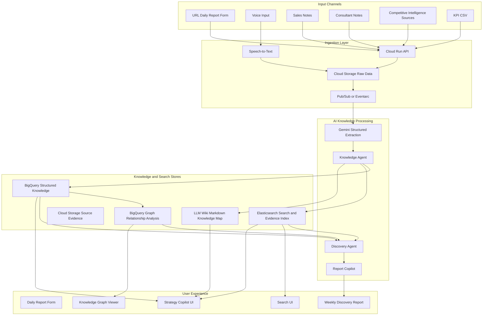

# Requirements Document: Continuous Discovery Agent MVP

## 1. Introduction

Continuous Discovery Agent MVP is a hackathon-oriented organization learning platform that continuously collects qualitative business knowledge from sales conversations, daily reports, voice input, consultant notes, and competitive intelligence sources. The system converts unstructured information into lightweight structured knowledge, analyzes relationships among customer segments, products, issues, competitors, KPIs, events, observations, and hypotheses, and generates discovery reports that help consultants and business owners notice changes they may otherwise miss.

The MVP prioritizes ease of knowledge formation over perfect correctness. AI-extracted knowledge may contain some error, as human-entered business records also contain error. The system should therefore make knowledge easy to create, search, relate, and supersede, rather than requiring heavy approval workflows before value can be produced.

This Requirements Document is intended to be used as the first step in a Kiro-like flow. The next documents should be:

1. `design.md`: technical architecture, data model, service decomposition, API design, and UI design.
2. `tasks.md`: implementation tasks mapped back to these requirements.

## 2. Product Vision

The product does not act as an AI consultant that directly makes business decisions. Instead, it acts as an AI-supported organizational learning platform.

The core loop is:

```text
Observation
↓
Knowledge Formation
↓
Discovery
↓
Hypothesis
↓
Additional Observation
↓
Organizational Learning
```

The primary value is to discover changes that humans have not yet noticed, such as increasing competitor mentions, shifting customer needs, changing objections, emerging complaints, or segment-specific changes that may affect business KPIs.

## 3. Scope

### 3.1 In Scope for MVP

The MVP shall support the following scope:

- Initial company setup and basic business model definition.
- URL-based daily report form submission.
- Voice input for reducing field data entry burden.
- Manual upload or submission of sales notes, daily reports, and consultant notes.
- Ingestion of simple competitive intelligence data such as competitor website updates, press releases, recruitment posts, and industry news summaries.
- AI extraction of observations, entities, relationships, and hypotheses.
- Separation of observed facts from hypotheses.
- Storage of structured knowledge in BigQuery.
- Indexing of source documents and evidence snippets in Elasticsearch.
- Relationship analysis using BigQuery Graph.
- Rule-based statistical discovery detection.
- Weekly Discovery Report generation.
- Basic knowledge graph visualization focused on customer segments, issues, products, competitors, KPIs, observations, and hypotheses.
- Basic search and evidence retrieval through Elasticsearch.

### 3.2 Out of Scope for MVP

The MVP shall not include:

- Spanner or Spanner Graph implementation.
- Low-latency real-time graph traversal.
- Full CRM integration.
- Full Google Workspace, Slack, Teams, or email integration.
- Advanced machine learning anomaly detection.
- Strict human approval workflow before AI-extracted knowledge can be stored.
- Production-grade privacy, compliance, or tenant-isolation hardening.
- Automated business decision execution.
- Automated pricing, hiring, investment, or operational decisions.

### 3.3 Design Note on Spanner

Spanner and Spanner Graph shall not be used in the MVP due to cost constraints. However, the Design document should leave a note that Spanner Graph may be considered in a future version if low-latency operational graph traversal becomes necessary. For the MVP, relationship analysis shall be performed by BigQuery Graph, accepting higher query latency.

## 4. Assumptions

- The primary users are consultants, SME advisors, business owners, or business managers.
- The MVP is optimized for hackathon demonstration value rather than full enterprise readiness.
- Some AI extraction errors are acceptable if knowledge formation becomes easier and faster.
- Users value discovering business changes over perfect data governance in the MVP.
- BigQuery is the analytical source of truth for structured knowledge.
- Elasticsearch is a search and evidence retrieval index, not the source of truth.
- Cloud Storage stores raw source documents and evidence files.
- Gemini structured output is used to extract JSON-like knowledge objects from text and voice transcripts.
- BigQuery Graph is used for relationship analysis over structured entity and relationship tables.

## 5. Architecture Direction

The MVP architecture should generally follow this structure:



## 6. Agent Simplification

The MVP shall use a simplified agent model to keep the system small enough for a single Requirements document.

| MVP Agent | Responsibilities | Original Concept Coverage |
|---|---|---|
| Intake Agent | Setup, URL form intake, voice input, basic follow-up questions | Discovery Setup Agent, Research Agent |
| Knowledge Agent | Extract observations, entities, relationships, and hypotheses | Knowledge Curator Agent, Knowledge Formation Agent |
| Discovery Agent | Competitive signal intake, rule-based change detection, observation target updates | Competitive Intelligence Agent, Observation Agent, Discovery Agent |
| Report Copilot | Generate reports, answer questions with evidence, support consultant discussion | Strategy Copilot Agent, Execution Tracking Agent |

## 7. Data Store Responsibility

| Store | Responsibility | Source of Truth? |
|---|---|---|
| Cloud Storage | Raw documents, audio transcripts, uploaded notes, evidence files | Yes, for raw source data |
| BigQuery | Observations, entities, relationships, hypotheses, KPIs, report metrics | Yes, for structured analytical data |
| BigQuery Graph | Relationship analysis over BigQuery tables | Derived analytical view |
| Elasticsearch | Full-text search, facet search, hybrid retrieval, evidence retrieval | No, search index only |
| LLM Wiki Markdown | Company model, KPI definitions, observation policy, discovery log | Yes, for lightweight human-readable knowledge map |

If a retrieval use case can be fully satisfied by either BigQuery or Elasticsearch, the system shall prefer the store aligned with the primary purpose:

- Analytical aggregation, KPI trends, discovery detection, and graph analysis: BigQuery.
- Text search, evidence snippets, keyword search, semantic search, and facet exploration: Elasticsearch.

## 8. Glossary

| Term | Definition |
|---|---|
| Observation | An observed fact extracted from source information, such as a customer comment, sales note, event, or field report. |
| Hypothesis | A possible explanation for one or more observations. It must not be presented as fact. |
| Entity | A node-like concept such as customer segment, product, issue, competitor, KPI, event, or action. |
| Relationship | A typed link between entities, such as `CustomerSegment MENTIONS Issue` or `Issue IMPACTS KPI`. |
| Evidence | A source quote, document reference, transcript snippet, or event record supporting an observation or hypothesis. |
| Discovery Signal | A rule-based detection of a meaningful change, such as a sharp increase in price-related comments. |
| LLM Wiki | Markdown-based human-readable knowledge map containing company context, KPI definitions, observation policy, and important hypotheses. |

---

# 9. Requirements

## Requirement 1: Initial Company Setup

**User Story:** As a consultant, I want to register a company's basic business context, so that the system can interpret later observations using company-specific knowledge.

### Acceptance Criteria

1. WHEN a consultant creates a company workspace, THEN the system SHALL collect company name, business description, products or services, customer segments, competitors, current issues, and fixed KPIs.
2. WHEN initial setup is completed, THEN the system SHALL create an initial company model in the LLM Wiki.
3. WHEN initial setup is completed, THEN the system SHALL create initial entity records for products, customer segments, competitors, and KPIs in BigQuery.
4. WHEN a user updates company context, THEN the system SHALL update the LLM Wiki and relevant structured records.
5. IF the company context is incomplete, THEN the system SHALL still allow data collection to proceed and mark missing fields as unknown.

## Requirement 2: URL-Based Daily Report Collection

**User Story:** As a field user, I want to answer a daily report through a simple URL form, so that I can provide useful qualitative data without duplicate reporting work.

### Acceptance Criteria

1. WHEN a consultant creates a report request, THEN the system SHALL generate a shareable URL form.
2. WHEN a field user opens the form, THEN the system SHALL display lightweight questions related to the current observation policy.
3. WHEN a field user submits a form, THEN the system SHALL store the raw submission in Cloud Storage.
4. WHEN a field user submits a form, THEN the system SHALL trigger AI extraction of observations, entities, relationships, and hypotheses.
5. IF the user provides short or vague input, THEN the system SHOULD ask one or more follow-up questions when additional information is important.
6. IF the user skips a question, THEN the system SHALL still accept the report.
7. The form SHALL prioritize information acquisition while keeping the number of required fields minimal.

## Requirement 3: Voice Input Support

**User Story:** As a busy field user, I want to submit observations by voice, so that the system can collect field knowledge without increasing typing burden.

### Acceptance Criteria

1. WHEN a user records or uploads voice input, THEN the system SHALL transcribe the audio.
2. WHEN transcription completes, THEN the system SHALL store the transcript as raw source data.
3. WHEN transcription completes, THEN the system SHALL trigger the same AI extraction workflow used for text reports.
4. IF transcription confidence is low, THEN the system SHOULD preserve the original transcript and mark the extracted observations with lower confidence.
5. The system SHALL allow voice input to be associated with company workspace, date, source type, and optional user role.

> **Implementation Note (M2):** M2 ではテキストによる会話インテーク（`/intake/chat`）で本要件を代替する。会話内容は transcript として `voice_transcript` ソースに保存され、テキスト日報と同一の抽出ワークフローを起動する（AC 2, 3, 5 を満たす）。実音声の Speech-to-Text（AC 1）および低信頼度時の扱い（AC 4）は後続マイルストーンで実装する。要件そのものは変更しない。

## Requirement 4: Source Data Ingestion

**User Story:** As a consultant, I want to upload or collect multiple types of qualitative information, so that the system can form knowledge from offline and external signals.

### Acceptance Criteria

1. WHEN a user uploads sales notes, consultant notes, daily reports, or KPI CSV files, THEN the system SHALL store them in Cloud Storage.
2. WHEN competitive intelligence data is added, THEN the system SHALL store the source URL, source type, title, body text, and collection date.
3. WHEN new raw data is stored, THEN the system SHALL trigger downstream AI processing through an event-driven mechanism.
4. WHEN raw data is processed, THEN the system SHALL retain a link between extracted knowledge and the original source.
5. IF a source cannot be parsed, THEN the system SHALL record a processing error and preserve the original file.

## Requirement 5: AI Knowledge Structuring

**User Story:** As a consultant, I want unstructured notes and conversations to be converted into structured knowledge, so that I can analyze relationships and changes without manually organizing every detail.

### Acceptance Criteria

1. WHEN source text is processed, THEN the system SHALL extract observations.
2. WHEN source text is processed, THEN the system SHALL extract or infer relevant entities.
3. WHEN source text is processed, THEN the system SHALL extract relationships among entities.
4. WHEN source text suggests a possible cause or explanation, THEN the system SHALL create a hypothesis separate from observed facts.
5. WHEN extracting knowledge, THEN the system SHALL use a structured output schema for observations, entities, relationships, hypotheses, and evidence references.
6. WHEN extracted knowledge is stored, THEN the system SHALL include source reference, timestamp, confidence score, and extraction method.
7. The system SHALL prioritize fast knowledge formation over perfect correctness in the MVP.
8. The system SHALL NOT require human approval before storing AI-extracted knowledge in the MVP.
9. The system SHALL allow later correction, deletion, merging, or supersession of extracted knowledge.

## Requirement 6: Observed Fact and Hypothesis Separation

**User Story:** As a consultant, I want observed facts and hypotheses to be clearly separated, so that I can understand what actually happened and what the system is only inferring.

### Acceptance Criteria

1. WHEN the system stores an observation, THEN it SHALL mark it as an observed fact.
2. WHEN the system stores a hypothesis, THEN it SHALL mark it as a hypothesis.
3. WHEN generating reports, THEN the system SHALL display observations and hypotheses in separate sections.
4. WHEN a hypothesis is shown, THEN the system SHALL include supporting observations where available.
5. WHEN evidence is insufficient, THEN the system SHALL show the hypothesis as low confidence or under observation.
6. The system SHALL NOT present hypotheses as confirmed business facts.
7. The system SHALL NOT make final business decisions on behalf of the user.

## Requirement 7: BigQuery Structured Knowledge Store

**User Story:** As a product operator, I want structured knowledge to be stored in BigQuery, so that observations, entities, relationships, hypotheses, and KPIs can be analyzed consistently.

### Acceptance Criteria

1. The system SHALL store observations in a BigQuery table.
2. The system SHALL store entities in a BigQuery table.
3. The system SHALL store relationships in a BigQuery table.
4. The system SHALL store hypotheses in a BigQuery table.
5. The system SHALL store KPI snapshots in a BigQuery table.
6. Each structured record SHALL include `workspace_id` or equivalent workspace identifier.
7. Each observation SHALL include source reference, source type, observed timestamp, summary, optional quote, confidence score, and related entities.
8. Each relationship SHALL include source entity, target entity, relationship type, evidence count, first seen timestamp, last seen timestamp, and strength score where available.
9. BigQuery SHALL be the source of truth for structured analytical data.

## Requirement 8: Elasticsearch Search and Evidence Retrieval

**User Story:** As a consultant, I want to search source notes and evidence quickly, so that I can verify discoveries and explore qualitative business signals.

### Acceptance Criteria

1. WHEN source documents are processed, THEN the system SHALL index searchable text in Elasticsearch.
2. WHEN observations are extracted, THEN the system SHALL index observation summaries and evidence snippets in Elasticsearch.
3. Elasticsearch SHALL support keyword search across source documents and observations.
4. Elasticsearch SHALL support filtering by workspace, date, source type, customer segment, product, competitor, issue, and confidence where available.
5. Elasticsearch SHOULD support hybrid search combining lexical search and semantic vector search.
6. WHEN a user searches for evidence, THEN the system SHALL return source snippets and source references.
7. Elasticsearch SHALL NOT be treated as the source of truth for structured knowledge.
8. IF BigQuery and Elasticsearch contain overlapping data, THEN BigQuery SHALL be preferred for analytical aggregation and Elasticsearch SHALL be preferred for text and evidence retrieval.
9. IF a use case appears fully covered by either BigQuery or Elasticsearch, THEN the Design document SHALL explicitly decide the primary store based on purpose.

## Requirement 9: Relationship Analysis with BigQuery Graph

**User Story:** As a consultant, I want to analyze relationships among customer segments, products, issues, competitors, KPIs, observations, and hypotheses, so that I can understand how qualitative signals connect to business outcomes.

### Acceptance Criteria

1. The system SHALL model selected BigQuery entity and relationship tables as a graph for analysis.
2. The system SHALL support graph analysis over at least the following node types: CustomerSegment, Product, Issue, Competitor, CompetitiveEvent, KPI, Observation, and Hypothesis.
3. The system SHALL support relationship types such as MENTIONS, HAS_ISSUE, RELATES_TO, COMPETES_WITH, MAY_CAUSE, IMPACTS, SUPPORTS, and CONTRADICTS where applicable.
4. WHEN a user selects a customer segment, THEN the system SHOULD show related issues, products, competitors, KPIs, observations, and hypotheses.
5. WHEN a discovery signal is detected, THEN the system SHOULD identify related graph nodes and relationships.
6. The system SHALL accept higher latency for graph analysis in the MVP.
7. The system SHALL NOT use Spanner or Spanner Graph in the MVP.
8. The Design document SHALL include a future note that Spanner Graph may be considered if low-latency operational graph traversal becomes necessary.

## Requirement 10: LLM Wiki Knowledge Map

**User Story:** As a consultant, I want the system to maintain a lightweight human-readable company knowledge map, so that both humans and AI agents can share company context.

### Acceptance Criteria

1. The system SHALL maintain Markdown-based LLM Wiki content for each company workspace.
2. The LLM Wiki SHALL include company profile, products, customer segments, competitors, KPI definitions, observation policy, active hypotheses, and discovery log.
3. WHEN the initial company setup is completed, THEN the system SHALL create initial Wiki pages.
4. WHEN major discoveries or observation policy changes occur, THEN the system SHOULD update relevant Wiki pages.
5. The LLM Wiki SHALL contain summaries and navigation context, not full raw source documents.
6. Raw source evidence SHALL remain in Cloud Storage and searchable indexes.

## Requirement 11: Rule-Based Discovery Detection

**User Story:** As a consultant, I want the system to detect changes using simple statistical rules, so that I can notice important shifts without waiting for complex machine learning models.

### Acceptance Criteria

1. The system SHALL calculate basic weekly counts for issues, competitors, products, customer segments, and observation types.
2. The system SHALL detect increases using previous week comparison.
3. The system SHOULD detect increases using rolling average comparison where sufficient history exists.
4. The system SHOULD detect new entity appearance, such as a newly mentioned competitor or issue.
5. The system SHOULD detect co-occurrence between competitor events and issue increases.
6. The system SHALL label detected changes as discovery signals.
7. Each discovery signal SHALL include metric name, current value, baseline value, change rate, related entities, and supporting evidence count.
8. The system SHALL use rule-based statistical detection in the MVP rather than advanced anomaly detection models.
9. The system SHALL allow thresholds to be configured at the workspace level.

## Requirement 12: Observation Policy and Follow-Up Questions

**User Story:** As a consultant, I want the system to decide what additional information to ask for, so that field data collection follows the current business discovery focus.

### Acceptance Criteria

1. The system SHALL maintain an observation policy for each company workspace.
2. The observation policy SHALL include current focus topics, priority customer segments, target products, target competitors, and active hypotheses.
3. WHEN new discovery signals appear, THEN the system SHOULD update recommended observation topics.
4. WHEN a field user submits vague input, THEN the system SHOULD generate follow-up questions based on the observation policy.
5. Follow-up questions SHOULD prioritize acquiring important missing information over minimizing all user effort.
6. Follow-up questions SHOULD remain concise and avoid unnecessary repetition.
7. The system SHALL support both text and voice responses to follow-up questions.
8. The system SHALL allow a user to skip follow-up questions.

## Requirement 13: Weekly Discovery Report

**User Story:** As a consultant, I want a weekly discovery report, so that I can understand what changed, what may explain it, and what to observe next.

### Acceptance Criteria

1. The system SHALL generate a weekly Discovery Report for each active workspace.
2. The report SHALL include a summary of detected discovery signals.
3. The report SHALL include observed facts separately from hypotheses.
4. The report SHALL include supporting evidence counts and representative evidence snippets where available.
5. The report SHALL include related customer segments, products, competitors, issues, and KPIs.
6. The report SHALL include recommended observation topics for the next period.
7. The report SHALL avoid presenting hypotheses as confirmed causes.
8. The report SHALL include links or references to searchable evidence.
9. The report SHOULD be generated from BigQuery analytical data, Elasticsearch evidence search, and LLM Wiki context.

## Requirement 14: Knowledge Graph Visualization

**User Story:** As a consultant, I want to visualize relationships among customer attributes, products, issues, competitors, KPIs, and hypotheses, so that I can explain discoveries and explore the company's knowledge network.

### Acceptance Criteria

1. The system SHALL provide a basic graph visualization interface.
2. The graph visualization SHALL show at least CustomerSegment, Product, Issue, Competitor, KPI, Observation, and Hypothesis nodes.
3. The graph visualization SHALL show relationship types between nodes.
4. WHEN a user selects a node, THEN the system SHALL display related observations and evidence references where available.
5. WHEN a user filters by time period, THEN the visualization SHOULD update relationships and counts for the selected period.
6. The visualization SHALL be optimized for demo clarity rather than complete graph database functionality.
7. The visualization SHOULD avoid overly dense graphs by limiting the number of displayed nodes or grouping low-priority nodes.

## Requirement 15: Search UI and Evidence Exploration

**User Story:** As a consultant, I want to search and filter evidence, so that I can validate system findings and discover additional qualitative signals.

### Acceptance Criteria

1. The system SHALL provide a search interface backed by Elasticsearch.
2. The search interface SHALL support keyword search.
3. The search interface SHOULD support semantic or hybrid search if implemented in the search backend.
4. The search interface SHALL support filters by date, source type, customer segment, product, competitor, and issue where available.
5. Search results SHALL show source title, source type, date, snippet, extracted tags, and evidence link.
6. WHEN a search result is selected, THEN the system SHALL show related observations and hypotheses if available.
7. Search results SHALL be used as supporting evidence in reports and Copilot answers.

## Requirement 16: Report Copilot

**User Story:** As a consultant, I want to ask questions about discoveries and evidence, so that I can use the system as a wall partner without letting it make decisions for me.

### Acceptance Criteria

1. The system SHALL provide a conversational interface for asking questions about stored knowledge.
2. The Copilot SHALL use LLM Wiki context, BigQuery analytical data, and Elasticsearch evidence search when answering.
3. The Copilot SHALL distinguish observed facts from hypotheses.
4. The Copilot SHALL provide evidence references where available.
5. The Copilot SHALL NOT make final business decisions on behalf of the user.
6. The Copilot MAY suggest additional observation topics or questions.
7. The Copilot MAY explain possible interpretations of a discovery signal.
8. The Copilot SHALL phrase uncertain causal explanations as hypotheses.

## Requirement 17: Correction and Supersession

**User Story:** As a consultant, I want to correct or supersede AI-generated knowledge, so that the system can tolerate extraction errors without blocking knowledge formation.

### Acceptance Criteria

1. The system SHALL allow users to correct observation summaries.
2. The system SHALL allow users to merge duplicate entities.
3. The system SHALL allow users to mark relationships as incorrect or deprecated.
4. The system SHALL allow users to supersede a hypothesis with a revised hypothesis.
5. Corrections SHALL preserve the original extracted record where feasible for traceability.
6. Corrected records SHALL be used in future reports and visualizations.
7. The MVP SHALL NOT require correction before extracted knowledge becomes usable.

## Requirement 18: KPI Management

**User Story:** As a consultant, I want fixed KPIs to be stored separately from flexible observation topics, so that the system can connect changing qualitative signals to stable business outcomes.

### Acceptance Criteria

1. The system SHALL allow a workspace to define fixed KPIs during setup.
2. The system SHALL allow KPI snapshots to be uploaded or entered over time.
3. The system SHALL store KPI snapshots in BigQuery.
4. The system SHALL distinguish fixed KPIs from flexible observation topics.
5. Discovery signals SHOULD be related to KPIs where graph relationships or co-occurrence data are available.
6. The system SHALL NOT frequently change fixed KPI definitions automatically.
7. The system MAY update flexible observation topics based on discovery signals.

## Requirement 19: Simplified MVP Service Composition

**User Story:** As a hackathon team, I want a simplified architecture, so that the product can demonstrate its core value without excessive platform complexity.

### Acceptance Criteria

1. The MVP SHALL be implementable using a small number of services.
2. The MVP SHOULD use Cloud Run for APIs and background workers.
3. The MVP SHOULD use Cloud Storage for raw data.
4. The MVP SHOULD use BigQuery for structured data and analytics.
5. The MVP SHOULD use BigQuery Graph for relationship analysis.
6. The MVP SHOULD use Elasticsearch for search and evidence retrieval.
7. The MVP SHOULD use Gemini for structured extraction, summarization, hypothesis generation, and report generation.
8. The MVP SHALL NOT include Spanner.
9. The MVP SHALL keep the number of agents to four or fewer logical agents.
10. The MVP SHALL keep requirements within this single Requirements document.

## Requirement 20: MVP Guardrails

**User Story:** As a product owner, I want clear guardrails for the MVP, so that the system creates value while avoiding misleading outputs.

### Acceptance Criteria

1. The system SHALL separate facts and hypotheses.
2. The system SHALL include evidence references where available.
3. The system SHALL avoid claiming unsupported causality.
4. The system SHALL not automate final business decisions.
5. The system SHALL prioritize knowledge formation speed over perfect correctness.
6. The system SHALL allow users to correct or supersede AI-generated knowledge.
7. The system SHOULD keep privacy and compliance controls minimal in the MVP unless required by demo data.
8. The system SHOULD use demo-safe or anonymized data for hackathon presentation.
9. The system SHALL make its limitations visible in reports or UI where appropriate.

---

# 10. Minimal Data Model for Design Phase

The Design document should refine the following minimal data model.

## 10.1 Observation

```json
{
  "observation_id": "obs_001",
  "workspace_id": "workspace_001",
  "source_id": "source_001",
  "source_type": "daily_report",
  "observed_at": "2026-06-10T10:00:00+09:00",
  "summary": "Small retail customers mentioned price concerns more often than usual.",
  "quote": "Competitor A seems cheaper recently.",
  "fact_or_hypothesis": "fact",
  "confidence": 0.78,
  "related_entity_ids": ["ent_customer_segment_small_retail", "ent_issue_price"],
  "evidence_uri": "gs://bucket/source_001.txt"
}
```

## 10.2 Entity

```json
{
  "entity_id": "ent_issue_price",
  "workspace_id": "workspace_001",
  "entity_type": "Issue",
  "name": "Price concern",
  "aliases": ["expensive", "price objection"],
  "attributes": {}
}
```

## 10.3 Relationship

```json
{
  "relationship_id": "rel_001",
  "workspace_id": "workspace_001",
  "from_entity_id": "ent_customer_segment_small_retail",
  "to_entity_id": "ent_issue_price",
  "relationship_type": "MENTIONS",
  "strength": 0.64,
  "evidence_count": 12,
  "first_seen_at": "2026-06-01T00:00:00+09:00",
  "last_seen_at": "2026-06-10T00:00:00+09:00"
}
```

## 10.4 Hypothesis

```json
{
  "hypothesis_id": "hyp_001",
  "workspace_id": "workspace_001",
  "statement": "Competitor A's campaign may be increasing price-related objections.",
  "status": "observing",
  "confidence": 0.61,
  "supporting_observation_ids": ["obs_001", "obs_014"],
  "contradicting_observation_ids": [],
  "recommended_observations": [
    "Check lost deal reasons",
    "Ask whether customers compared with Competitor A",
    "Monitor price-related comments next week"
  ]
}
```

## 10.5 Discovery Signal

```json
{
  "signal_id": "sig_001",
  "workspace_id": "workspace_001",
  "signal_type": "weekly_increase",
  "metric_name": "price_related_mentions",
  "current_value": 31,
  "baseline_value": 18,
  "change_rate": 0.72,
  "related_entity_ids": ["ent_issue_price", "ent_customer_segment_small_retail"],
  "evidence_count": 31,
  "detected_at": "2026-06-10T09:00:00+09:00"
}
```

---

# 11. Design and Tasks Handoff Notes

## 11.1 Design Document Should Define

The next `design.md` should define:

1. Detailed cloud architecture.
2. Cloud Run services and APIs.
3. BigQuery table schemas.
4. BigQuery Graph node and edge definitions.
5. Elasticsearch index mappings.
6. Gemini structured output schemas.
7. Report generation flow.
8. Search and evidence retrieval flow.
9. Graph visualization API.
10. MVP UI screens.
11. Error handling and retry strategy.
12. Minimal security assumptions for hackathon demo.

## 11.2 Tasks Document Should Include

The following `tasks.md` should include implementation tasks such as:

1. Create Cloud Storage buckets.
2. Create BigQuery dataset and tables.
3. Create Elasticsearch indexes.
4. Implement URL report form.
5. Implement voice transcription flow.
6. Implement Gemini extraction worker.
7. Implement BigQuery insertion pipeline.
8. Implement Elasticsearch indexing pipeline.
9. Implement rule-based discovery detection SQL.
10. Implement BigQuery Graph definitions and sample queries.
11. Implement Weekly Discovery Report generator.
12. Implement simple search UI.
13. Implement simple graph viewer.
14. Implement Report Copilot prompt and retrieval logic.
15. Prepare demo dataset and scenario.

---

# 12. References for Design Phase

The Design phase should refer to the following product documentation and platform capabilities:

- Kiro Feature Specs guide the flow from requirements gathering to technical design and implementation planning.
- BigQuery Graph models data as nodes and edges and supports graph analytics with GQL over BigQuery data.
- Elasticsearch hybrid search can combine BM25 lexical search and vector semantic search for RAG and AI agent retrieval use cases.
- Gemini structured output supports JSON schema-based extraction, useful for converting unstructured text into observations, entities, relationships, and hypotheses.

